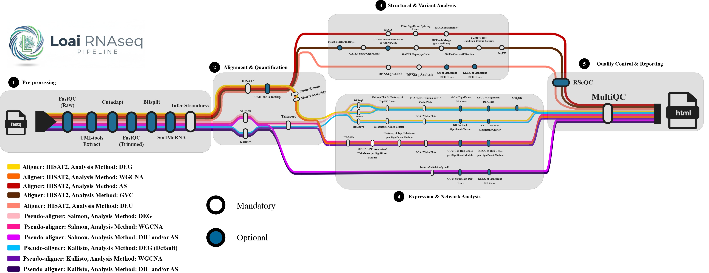

# LoaiEletr/rnaseq

<h1>
  <picture>
    <source media="(prefers-color-scheme: dark)" srcset="docs/images/LoaiEletr-rnaseq_logo_light.png">
    
  </picture>
</h1>

[](https://github.com/codespaces/new/LoaiEletr/rnaseq)
[](https://github.com/LoaiEletr/rnaseq/actions/workflows/nf-test.yml)
[](https://github.com/LoaiEletr/rnaseq/actions/workflows/linting.yml)[](https://doi.org/10.5281/zenodo.19028214)
[](https://www.nf-test.com)

[](https://www.nextflow.io/)
[](https://github.com/nf-core/tools/releases/tag/3.5.1)
[](https://docs.conda.io/en/latest/)
[](https://www.docker.com/)
[](https://sylabs.io/docs/)
[](https://cloud.seqera.io/launch?pipeline=https://github.com/LoaiEletr/rnaseq)

## Introduction

**LoaiEletr/rnaseq** is a comprehensive RNA-seq analysis pipeline designed for organisms with a reference genome and annotation. It takes a samplesheet with FASTQ files as input, performs extensive quality control, adapter trimming, contamination removal, and UMI handling, then provides multiple downstream analysis options including differential gene expression, co-expression network analysis, alternative splicing, differential isoform/exon usage, and germline variant calling all in a single integrated workflow.



## Pipeline summary

1. **Pre-processing**
   - Raw Read QC: Initial quality assessment of raw sequencing data ([`FastQC`](https://www.bioinformatics.babraham.ac.uk/projects/fastqc/)).
   - UMI Extraction: (Optional) Handling Unique Molecular Identifiers for accurate deduplication ([`UMI-tools`](https://github.com/CGATOxford/UMI-tools)).
   - Adapter Trimming: Removal of sequencing adapters and low-quality bases ([`Cutadapt`](https://cutadapt.readthedocs.io/)).
   - Trimmed QC: Secondary quality check after adapter and quality trimming ([`FastQC`](https://www.bioinformatics.babraham.ac.uk/projects/fastqc/)).
   - Contamination Removal: Filtering out non-target genomic sequences ([`BBSplit`](https://jgi.doe.gov/data-and-tools/bbtools/)).
   - rRNA Removal: Depletion of ribosomal RNA sequences to improve signal-to-noise ratio ([`SortMeRNA`](https://github.com/biocore/sortmerna)).
   - Strandedness Inference: Automatic detection of library strandedness via Salmon subsampling.

2. **Alignment & Quantification**
   - The workflow branches into one of the following three routes based on user selection:
     - **Route 1**: Genomic alignment using [`HISAT2`](http://daehwankimlab.github.io/hisat2/), a splice-aware aligner.
     - **Route 2**: Pseudoalignment and quantification using [`Salmon`](https://combine-lab.github.io/salmon/).
     - **Route 3**: Pseudoalignment and quantification using [`Kallisto`](https://pachterlab.github.io/kallisto/).
   - Post-Alignment Processing:
     - Sort and index BAM files ([`SAMtools`](https://sourceforge.net/projects/samtools/files/samtools/)).
     - (Optional) UMI-based deduplication ([`UMI-tools`](https://github.com/CGATOxford/UMI-tools)).
   - Matrix Assembly:
     - For HISAT2 + featureCounts: Custom R script to combine featureCounts matrices into a single gene-level count matrix.
     - For Salmon/Kallisto: Aggregating quantification results into gene or transcript-level matrices ([`tximport`](https://bioconductor.org/packages/release/bioc/html/tximport.html)).

3. **Structural & Variant Analysis** (Optional: HISAT2 Route Only)
   - These steps are executed if HISAT2 is selected and specific analysis flags are enabled:
     - Germline Variant Calling (GVC):
       - Duplicate read marking ([`Picard MarkDuplicates`](https://broadinstitute.github.io/picard/)).
       - Splitting reads containing Ns in CIGAR strings ([`GATK4 SplitNCigarReads`](https://gatk.broadinstitute.org/hc/en-us/articles/5358868769307-SplitNCigarReads)).
       - Base quality score recalibration ([`GATK4 BaseRecalibrator`](https://gatk.broadinstitute.org/hc/en-us/articles/5358897001371-BaseRecalibrator), [`GATK4 ApplyBQSR`](https://gatk.broadinstitute.org/hc/en-us/articles/5358826654875-ApplyBQSR)).
       - SNP and Indel calling ([`GATK4 HaplotypeCaller`](https://gatk.broadinstitute.org/hc/en-us/articles/5358864757787-HaplotypeCaller)).
       - Variant filtration and functional annotation ([`GATK4 VariantFiltration`](https://gatk.broadinstitute.org/hc/en-us/articles/5358912683419-VariantFiltration), [`SnpEff`](http://snpeff.sourceforge.net/)).
     - Alternative Splicing (AS):
       - Detection of differential splicing events using [`rMATS`](http://rnaseq-mats.sourceforge.net/).
       - Filtering of significant events based on FDR, delta PSI, and coverage thresholds.
       - Visualization of splicing events with sashimi plots ([`rmats2sashimiplot`](https://github.com/Xinglab/rmats2sashimiplot)).
     - Differential Exon Usage (DEU): Identification of exon-level expression changes ([`DEXSeq`](https://bioconductor.org/packages/release/bioc/html/DEXSeq.html)) with optional functional enrichment (GO and KEGG).

4. **Expression & Network Analysis**
   - Available for all aligners; users can select multiple methods simultaneously:
     - Differential Gene Expression (DEG): Statistical testing using [`DESeq2`](https://bioconductor.org/packages/release/bioc/html/DESeq2.html), [`limma`](https://bioconductor.org/packages/release/bioc/html/limma.html), or [`MASIGPro`](https://www.bioconductor.org/packages/release/bioc/html/maSigPro.html) (for time-course data) followed by optional functional enrichment (GO, KEGG, and MSigDB GSEA).
     - Network Analysis (WGCNA): Construction of weighted co-expression networks to identify gene modules and hub genes ([`WGCNA`](https://horvath.genetics.ucla.edu/html/CoexpressionNetwork/Rpackages/WGCNA/)) with optional functional enrichment (GO and KEGG).
     - Differential Isoform Usage (DIU): Analysis of isoform switching events using [`IsoformSwitchAnalyzerR`](https://bioconductor.org/packages/release/bioc/html/IsoformSwitchAnalyzeR.html) with optional functional enrichment (GO and KEGG).

5. **Quality Control & Reporting**
   - Post-alignment QC: Comprehensive RNA-seq quality assessment using [`RSeQC`](http://rseqc.sourceforge.net/) modules including:
     - `bam_stat`: Alignment statistics
     - `genebody_coverage`: Coverage uniformity across gene bodies
     - `infer_experiment`: Strandedness inference
     - `inner_distance`: Fragment size distribution
     - `junction_annotation`: Splice junction annotation
     - `read_distribution`: Read distribution across genomic features
     - `read_duplication`: Read duplication rates
     - `tin`: Transcript integrity number
   - Final Reporting: All tool logs, QC metrics, and analysis summaries are compiled into a single interactive dashboard ([`MultiQC`](http://multiqc.info/)).

## Usage

> [!NOTE]
> If you are new to Nextflow and nf-core, please refer to [this page](https://nf-co.re/docs/usage/installation) on how to set-up Nextflow. Make sure to [test your setup](https://nf-co.re/docs/usage/introduction#how-to-run-a-pipeline) with `-profile test` before running the workflow on actual data.

> **Note**
> Users must select **one aligner per run** (`--aligner hisat2` or `--pseudo_aligner salmon/kallisto`), which then dictates the available downstream analysis methods. The `--analysis_method` parameter accepts a comma-separated list, allowing you to run **multiple compatible analyses simultaneously** based on your chosen aligner:
>
> - **HISAT2**: Supports `DEG` (DESeq2/limma/maSigPro), `WGCNA`, `AS` (rMATS), `DEU` (DEXSeq), and `GVC` (GATK4)
> - **Salmon/Kallisto**: Supports `DEG`, `WGCNA`, and (`DIU` and/or `AS`) via IsoformSwitchAnalyzerR
>
> For example, with HISAT2 you can run differential expression, co-expression network, alternative splicing, and differential exon usage all in one command:
>
> ```bash
> --aligner hisat2 --analysis_method DEG,WGCNA,AS,DEU
> ```
>
> With Salmon/Kallisto, you can run differential expression, co-expression network, and both isoform switching and alternative splicing analysis:
>
> ```bash
> --pseudo_aligner salmon --analysis_method DEG,WGCNA,DIU,AS
> ```

First, prepare a samplesheet with your input data that looks as follows:

**samplesheet.csv**:

```csv
sample_id,fastq_1,fastq_2,condition,lib_type,sequencer
CONTROL_REP1,/path/to/fastq/files/control_rep1_R1.fastq.gz,/path/to/fastq/files/control_rep1_R2.fastq.gz,control,reverse,NextSeq
CONTROL_REP2,/path/to/fastq/files/control_rep2_R1.fastq.gz,/path/to/fastq/files/control_rep2_R2.fastq.gz,control,reverse,NovaSeq
CONTROL_REP3,/path/to/fastq/files/control_rep3_R1.fastq.gz,/path/to/fastq/files/control_rep3_R2.fastq.gz,control,reverse,NovaSeq
TREATED_REP1,/path/to/fastq/files/treated_rep1_R1.fastq.gz,/path/to/fastq/files/treated_rep1_R2.fastq.gz,treated,forward,MiSeq
TREATED_REP2,/path/to/fastq/files/treated_rep2_R1.fastq.gz,/path/to/fastq/files/treated_rep2_R2.fastq.gz,treated,forward,HiSeq
TREATED_REP3,/path/to/fastq/files/treated_rep3_R1.fastq.gz,/path/to/fastq/files/treated_rep3_R2.fastq.gz,treated,forward,HiSeq
```

Each row represents a biological replicate. The pipeline auto-detects whether a sample is single-end (only `fastq_1` provided) or paired-end (both `fastq_1` and `fastq_2` provided).

| Column      | Description                                                                                                                                                                                                                                                                                                                                                    |
| ----------- | -------------------------------------------------------------------------------------------------------------------------------------------------------------------------------------------------------------------------------------------------------------------------------------------------------------------------------------------------------------- |
| `sample_id` | Custom sample name (no spaces allowed). Unique identifier for each biological replicate.                                                                                                                                                                                                                                                                       |
| `fastq_1`   | Full path to FastQ file for read 1. File must be gzipped and have the extension ".fastq.gz" or ".fq.gz".                                                                                                                                                                                                                                                       |
| `fastq_2`   | Full path to FastQ file for read 2 (paired-end only). Leave empty for single-end data.                                                                                                                                                                                                                                                                         |
| `condition` | Experimental condition. Must contain **exactly two unique values** across all samples, with **at least 3 replicates per condition**. The control condition **must** contain the word "control" (case-insensitive, e.g., "control", "CONTROL", "Control_sample"). The other condition can be any user-defined name (e.g., "treated", "knockout", "stimulated"). |
| `lib_type`  | Library strandedness. Must be one of: `forward`, `reverse`, or `auto`. If set to `auto`, the pipeline will subsample reads and use Salmon to automatically infer strandedness for correct alignment.                                                                                                                                                           |
| `sequencer` | Sequencing platform. Must be one of: `HiSeq`, `MiSeq`, `NovaSeq`, or `NextSeq`. Used for platform-specific trimming parameters (e.g., `--nextseq-trim=20` for NovaSeq/NextSeq data).                                                                                                                                                                           |

**Important requirements:**

- **Two conditions only**: The pipeline supports exactly two experimental conditions (e.g., control vs treated). Do not include more than two unique values in the `condition` column.
- **Minimum 3 replicates per condition**: Each condition must have at least three biological replicates to ensure statistical power for differential analysis.
- **Control condition naming**: Must contain the word "control" (case-insensitive) to properly identify the reference group for comparisons.
- **No multi-lane/technical replicates**: Each row represents a unique biological replicate. Technical replicates (multiple sequencing runs of the same sample) are not supported.
- **Single or paired-end**: Automatically detected based on whether `fastq_2` is provided or empty.
- **Strandedness auto-detection**: Use `auto` in the `lib_type` column if you are unsure about the library strandedness. The pipeline will infer it automatically via Salmon subsampling.

> [!WARNING]
> Please provide pipeline parameters via the CLI or Nextflow `-params-file` option. Custom config files including those provided by the `-c` Nextflow option can be used to provide any configuration _**except for parameters**_; see [docs](https://nf-co.re/docs/usage/getting_started/configuration#custom-configuration-files).

Now, you can run the pipeline using:

```bash
nextflow run LoaiEletr/rnaseq \
    -profile <docker/singularity/conda/.../institute> \
    --input <SAMPLESHEET> \
    --outdir <OUTDIR> \
    --species <SPECIES> \
    --genome <GENOME_VERSION> \
    --analysis_method <DEG,WGCNA,AS,DEU,DIU,GVC> \
    --aligner <ALIGNER> \              # For genomic alignment (HISAT2) - use this OR pseudo_aligner
    --pseudo_aligner <PSEUDOALIGNER>  # For transcriptome pseudoalignment (Salmon/Kallisto) - use this OR aligner
```

For more details and further functionality, please refer to the [usage documentation](https://nf-co.re/rnaseq/usage) and the [parameter documentation](https://nf-co.re/rnaseq/parameters).

## Pipeline output

To see the results of an example test run with a full size dataset refer to the [results](https://nf-co.re/rnaseq/results) tab on the nf-core website pipeline page.
For more details about the output files and reports, please refer to the
[output documentation](https://nf-co.re/rnaseq/output).

## Credits

LoaiEletr/rnaseq was originally written by Loai Eletr.

## Contributions and Support

If you would like to contribute to this pipeline, please see the [contributing guidelines](.github/CONTRIBUTING.md).

## Citations

If you use LoaiEletr/rnaseq for your analysis, please cite it using the following doi: [10.5281/zenodo.19028214](https://doi.org/10.5281/zenodo.19028214)

An extensive list of references for the tools used by the pipeline can be found in the [`CITATIONS.md`](CITATIONS.md) file.

This pipeline uses code and infrastructure developed and maintained by the [nf-core](https://nf-co.re) community, reused here under the [MIT license](https://github.com/nf-core/tools/blob/main/LICENSE).

> **The nf-core framework for community-curated bioinformatics pipelines.**
>
> Philip Ewels, Alexander Peltzer, Sven Fillinger, Harshil Patel, Johannes Alneberg, Andreas Wilm, Maxime Ulysse Garcia, Paolo Di Tommaso & Sven Nahnsen.
>
> _Nat Biotechnol._ 2020 Feb 13. doi: [10.1038/s41587-020-0439-x](https://dx.doi.org/10.1038/s41587-020-0439-x).
