# LoaiEletr/rnaseq: Output

## Introduction

This document describes the output produced by the pipeline. Most of the plots presented in this document are taken from the MultiQC reports generated across several pipeline runs using different alignment and quantification strategies. The runs were performed using the commands below, which tested various configurations including different aligners (HISAT2, Salmon, Kallisto), analysis methods (GVC, DEG, DEU/DIU, AS), UMI handling, and contaminant species filtering on the lymphoblastoid cell lines dataset:

**Run 1: HISAT2 alignment with GVC analysis**

```bash
nextflow run --species human --genome GRCh38 -resume --input https://raw.githubusercontent.com/LoaiEletr/test-downstream-data/refs/heads/main/rnaseq/samplesheets/samplesheet_lymphoblastoid_celllines.csv --outdir shion -profile docker main.nf --fasta ~/Templates/hisat2stuff/chrX.fa --hisat2_index ~/Templates/hisat2stuff/index --pseudo_aligner null --aligner hisat2 --gtf ~/Templates/hisat2stuff/chrX.gtf --analysis_method GVC --skip_bbsplit --skip_sortmerna --skip_interval_splitting --bed ../chrX.bed --knownsites https://ftp.ensembl.org/pub/release-115/variation/vcf/homo_sapiens/homo_sapiens-chrX.vcf.gz
```

**Run 2: HISAT2 alignment with UMI processing and multiple analyses**

```bash
nextflow run --species human --genome GRCh38 -resume --input https://raw.githubusercontent.com/LoaiEletr/test-downstream-data/refs/heads/main/rnaseq/samplesheets/samplesheet_lymphoblastoid_celllines.csv --outdir shion -profile docker main.nf --fasta ~/Templates/hisat2stuff/chrX.fa --hisat2_index ~/Templates/hisat2stuff/index --pseudo_aligner null --aligner hisat2 --gtf ~/Templates/hisat2stuff/chrX.gtf --analysis_method DEG,DEU,AS --with_umi --umi_extract_method regex --lib_kit quantseq --contaminant_species worm
```

**Run 3: Salmon pseudoalignment with UMI processing**

```bash
nextflow run --species human --genome GRCh38 -resume --input https://raw.githubusercontent.com/LoaiEletr/test-downstream-data/refs/heads/main/rnaseq/samplesheets/samplesheet_lymphoblastoid_celllines.csv --outdir shion -profile docker main.nf --fasta ~/Templates/hisat2stuff/chrX.fa --hisat2_index ~/Templates/hisat2stuff/index --pseudo_aligner salmon --gtf ~/Templates/hisat2stuff/chrX.gtf --analysis_method DEG,DIU,AS --with_umi --umi_extract_method regex --lib_kit quantseq --contaminant_species worm
```

**Run 4: Kallisto pseudoalignment with UMI processing**

```bash
nextflow run --species human --genome GRCh38 -resume --input https://raw.githubusercontent.com/LoaiEletr/test-downstream-data/refs/heads/main/rnaseq/samplesheets/samplesheet_lymphoblastoid_celllines.csv --outdir shion -profile docker main.nf --fasta ~/Templates/hisat2stuff/chrX.fa --hisat2_index ~/Templates/hisat2stuff/index --pseudo_aligner kallisto --gtf ~/Templates/hisat2stuff/chrX.gtf --analysis_method DEG,DIU,AS --with_umi --umi_extract_method regex --lib_kit quantseq --contaminant_species worm
```

The directories listed below will be created in the results directory after the pipeline has finished. All paths are relative to the top-level results directory.

> [!TIP]  
> The pipeline supports two primary analysis routes: **genomic alignment (HISAT2)** and **transcriptome pseudoalignment (Salmon/Kallisto)**. Outputs are organized accordingly, and many files are only generated when the corresponding analysis method is selected (see [usage documentation](https://nf-co.re/rnaseq/usage)).

For the time-course analyses (WGCNA and maSigPro) presented in this document, two datasets were used:

**Dataset 1: Without time points (for WGCNA only)**  
This dataset from BioProject PRJNA525604 consists of control and disease samples with 5 biological replicates per condition:

```bash
Control samples:
- SRR8668769
- SRR8668771
- SRR8668772
- SRR8668773
- SRR8668774

Disease samples:
- SRR8668755
- SRR8668756
- SRR8668757
- SRR8668758
- SRR8668759
```

**Dataset 2: With time points (for WGCNA and maSigPro)**  
This dataset ([GSE39463](https://www.ncbi.nlm.nih.gov/geo/query/acc.cgi?acc=GSE39463)) captures the time-course response of Arabidopsis thaliana expressing the barley MLA1 immune receptor challenged with powdery mildew fungus (_Bgh_). The experimental design includes:

- **Time points**: 6, 12, 18, and 24 hours post inoculation (hpi)
- **Conditions**:

- Plants without MLA1 construct (pps)
- Plants with MLA1-HA construct (B12)
- Challenged with _Bgh_ isolate K1 (expressing AVRA1 effector) or isolate A6 (expressing other AVRA effectors)
- **Replicates**: 3 biological replicates per condition per time point

## Pipeline overview

The pipeline is built using [Nextflow](https://www.nextflow.io/) and processes data using the following steps:

- [Preprocessing](#preprocessing)
  - [FastQC (raw)](#fastqc-raw)
  - [UMI-tools extract](#umi-tools-extract)
  - [Cutadapt](#cutadapt)
  - [FastQC (trimmed)](#fastqc-trimmed)
  - [BBSplit](#bbsplit)
  - [SortMeRNA](#sortmerna)
  - [Strandedness inference](#strandedness-inference)
- [Alignment & Quantification](#alignment--quantification)
  - [HISAT2 alignment & featureCounts](#hisat2-alignment--featurecounts)
  - [Salmon pseudoalignment](#salmon-pseudoalignment)
  - [Kallisto pseudoalignment](#kallisto-pseudoalignment)
- [Post‑alignment processing](#postalignment-processing)
  - [SAMtools sort/index](#samtools-sortindex)
  - [UMI‑tools dedup](#umitools-dedup)
- [Germline Variant Calling (GVC)](#germline-variant-calling-gvc)
  - [Picard MarkDuplicates](#picard-markduplicates)
  - [GATK4 SplitNCigarReads, BaseRecalibrator, ApplyBQSR](#gatk4-splitncigarreads-baserecalibrator-applybqsr)
  - [HaplotypeCaller](#haplotypecaller)
  - [BCFtools merge](#bcftools-merge)
  - [VariantFiltration](#variantfiltration)
  - [BCFtools isec (Condition‑Specific Variant Analysis)](#bcftools-isec-conditionspecific-variant-analysis)
  - [SnpEff annotation](#snpeff-annotation)
- [Differential Analysis](#differential-analysis)
  - [rMATS (Alternative Splicing)](#rmats-alternative-splicing)
  - [DEXSeq (Differential Exon Usage)](#dexseq-differential-exon-usage)
  - [IsoformSwitchAnalyzeR (Differential Isoform Usage)](#isoformswitchanalyzer-differential-isoform-usage)
  - [Differential Gene Expression](#differential-gene-expression)
    - [DESeq2 (Steady-state)](#deseq2-steady-state)
    - [limma (Steady-state)](#limma-steady-state)
    - [maSigPro (Time-course)](#masigpro-time-course)
- [WGCNA (Co‑expression Network Analysis)](#wgcna-coexpression-network-analysis)

- [Quality Control](#quality-control)
  - [RSeQC](#rseqc)
  - [MultiQC](#multiqc)
- [Workflow reporting and genomes](#workflow-reporting-and-genomes)
  - [Reference files](#reference-files)
  - [Pipeline information](#pipeline-information)

## Preprocessing

Preprocessing steps are applied to the raw FASTQ files to prepare them for alignment/quantification. Output directories are created under `results/` as shown below.

### FastQC (raw)

<details markdown="1">
<summary>Output files</summary>

- `quality_control/fastqc/raw/<SAMPLE>/`
  - `<SAMPLE>_raw_fastqc.html` – FastQC report for raw reads.
  - `<SAMPLE>_raw_fastqc.zip` – Zip archive containing the report, data tables and plots.

</details>

[FastQC](http://www.bioinformatics.babraham.ac.uk/projects/fastqc/) provides quality metrics for the raw input reads. This step runs on the original FASTQ files before any trimming or filtering. For further reading and documentation see the [FastQC help pages](http://www.bioinformatics.babraham.ac.uk/projects/fastqc/Help/).

#### 1. Sequence Quantities and Quality

These plots provide the first indication of library complexity and base-calling accuracy.

##### Sequence Counts

This chart displays the total number of reads per sample, categorized by unique vs. duplicated sequences.

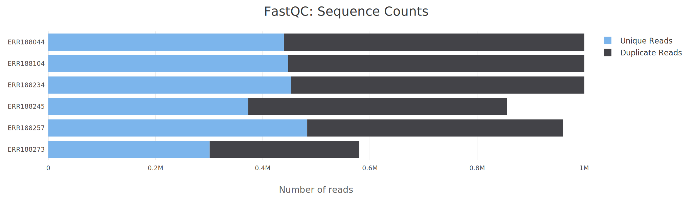

- **Unique vs. Duplicate:** A high proportion of "Duplicate Sequences" (black bars) can indicate PCR over-amplification or low library complexity.
- **Read Depth:** Ensure your samples have a sufficient number of total reads (typically >20 million for standard RNA-seq) to achieve statistical power in differential expression.

##### Per Base Sequence Quality

This is arguably the most important plot, showing the Phred quality score ($Q$) at each position in the read.

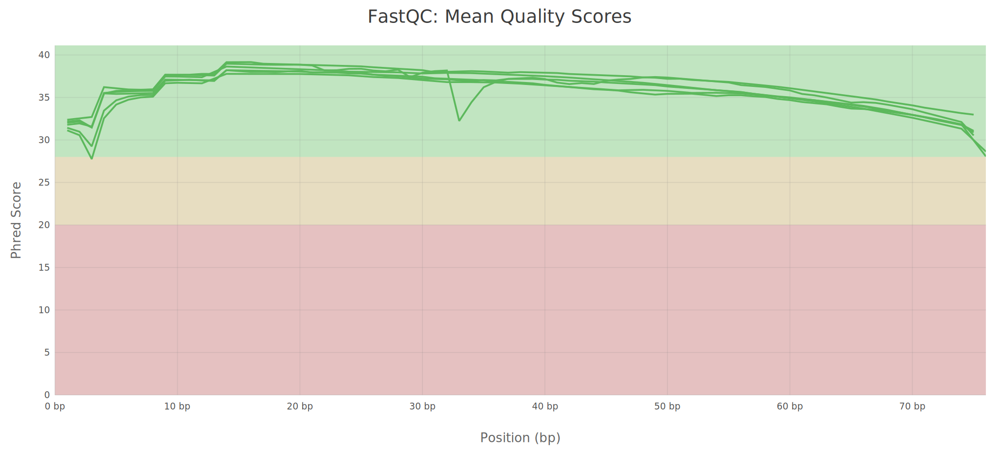

- **Phred Scores:** The y-axis represents the quality score. Values above **30** (green zone) indicate a **99.9%** base-calling accuracy.
- **Quality Drop:** It is normal for quality to drop slightly toward the end of the reads (3' end). If the scores dip into the red zone ($Q < 20$), quality trimming is recommended.

---

#### 2. Sequence Composition and Bias

These metrics help identify contamination, adapter interference, or biological anomalies.

##### Per Sequence GC Content

The GC content of your samples is compared against a theoretical normal distribution.

- **Ideal Curve:** A healthy library should show a smooth, unimodal distribution that closely matches the theoretical curve.
- **Shifts/Humps:** Deviations or secondary peaks often suggest contamination with another organism or the presence of overrepresented sequences.

##### Per Base N Content

This plot tracks the percentage of "N" calls (where the sequencer could not determine a base).

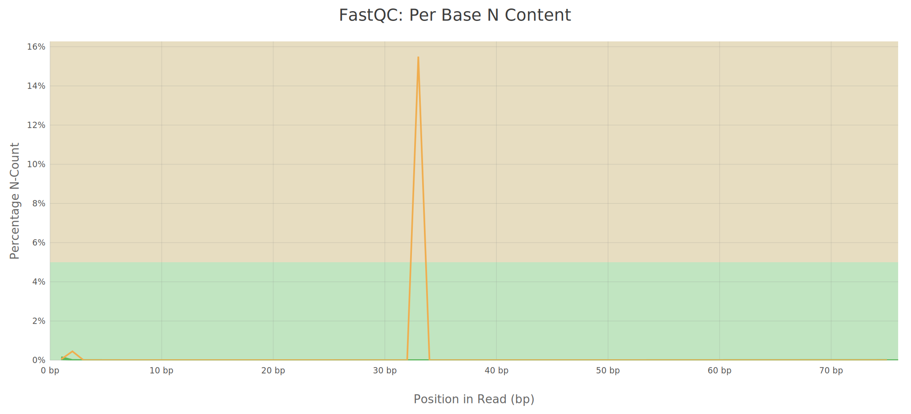

- **Observation:** The sequencing run is high-quality, indicated by a baseline N content near **0%**. However, due to an N-content spike observed in one sample at 33-34 bp, trimming the reads at this position is recommended.

---

#### 3. Library Artifacts

Identifying technical artifacts is essential for cleaning your data before alignment.

##### Overrepresented Sequences and Adapters

FastQC identifies sequences that appear more frequently than expected and checks for common sequencing adapters.

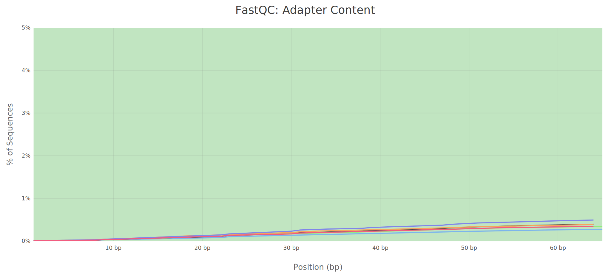

- **Adapter Contamination:** The plot shows a rise in adapter content toward the end of the reads (starting around 50–70 bp). This is common if the fragment size is shorter than the read length ("read-through") and requires adapter trimming.
- **Top Overrepresented Sequences:** Check the associated table to see if these sequences match known adapters, primers, or highly expressed biological sequences like rRNA.

##### Sequence Duplication Levels

This measures the degree to which the library contains identical sequences.

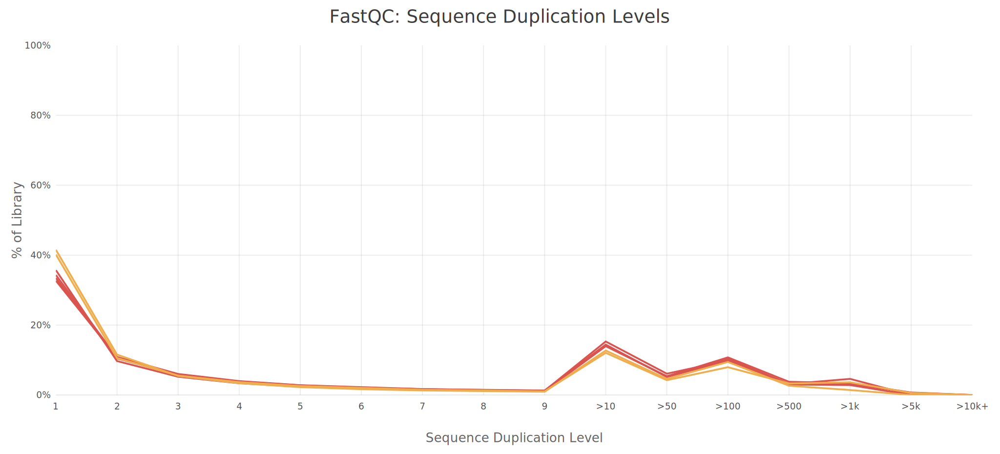

- **Interpretation:** A high percentage of sequences retained after deduplication is indicative of a diverse, high-quality library. This result is expected for RNA-Seq data, as the removal of PCR duplicates is generally minimal due to the inherent complexity of the transcriptome.

---

### UMI-tools extract

<details markdown="1">
<summary>Output files</summary>

- `preprocessing/umitools/<SAMPLE>/`
  - `<SAMPLE>_<LANE>.fastq.gz` – FASTQ file with UMI moved to the read header.
  - `<SAMPLE>_<LANE>.log` – Log file from UMI-tools extract.

</details>

When `--with_umi` is specified, [UMI-tools](https://github.com/CGATOxford/UMI-tools) extracts the unique molecular identifier from the read sequence and appends it to the read name. The resulting FASTQ files are used for downstream alignment. The barcode pattern is controlled by `--lib_kit`, `--umitools_bc_pattern`, and `--umitools_bc_pattern2`.

#### 1. UMI Extraction Success Rate

The extraction rate plot indicates how many reads contained a identifiable UMI based on your specified barcode pattern.

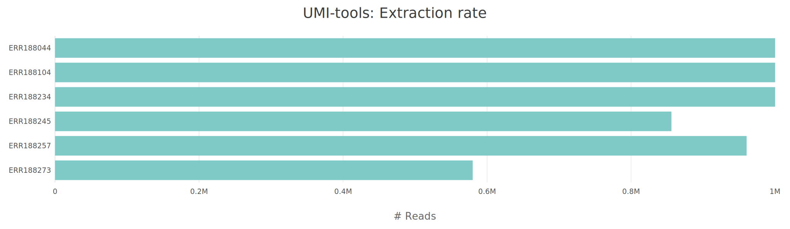

- **Extraction Success**: The blue bars represent "Reads with UMI extracted". In a high-quality library, the vast majority of reads should fall into this category.

#### 2. Regex Match Rate

This chart provides a more technical breakdown of how the barcodes were identified using regular expressions (regex).

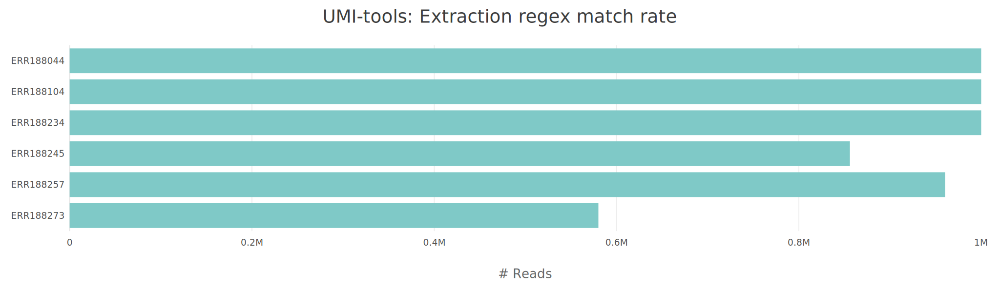

- **Regex Pattern**: The green bars indicate "Matched" reads, meaning the sequence followed the expected structure (e.g., a specific length or anchor sequence).
- **Non-Matches**: If a large portion of reads is "Unmatched," it implies that the biological sequence in the UMI position does not fit the expected kit architecture

#### 3. Impact on Downstream Analysis

Successful extraction is the prerequisite for **Deduplication**. By appending the UMI to the read name, the pipeline can later distinguish between:

1.  **Biological Duplicates**: Different molecules that happened to map to the same genomic location (different UMIs).
2.  **PCR Duplicates**: A single molecule that was amplified multiple times during library prep (identical UMIs).

### Cutadapt

<details markdown="1">
<summary>Output files</summary>

- `preprocessing/trimmed/<SAMPLE>/`
  - `<SAMPLE>.trimmed.fastq.gz` – Trimmed FASTQ file(s).
  - `<SAMPLE>.trimmed.json` – Cutadapt log in JSON format.

</details>

When `--skip_trimming` is **not** set, [Cutadapt](https://cutadapt.readthedocs.io/) removes adapter sequences and low‑quality bases. For NovaSeq/NextSeq data, `--nextseq-trim=20` is automatically applied; otherwise standard adapter trimming is performed.

#### 1. Filtered Reads Summary

This plot provides a high-level overview of the trimming process and how many reads were retained for downstream analysis.

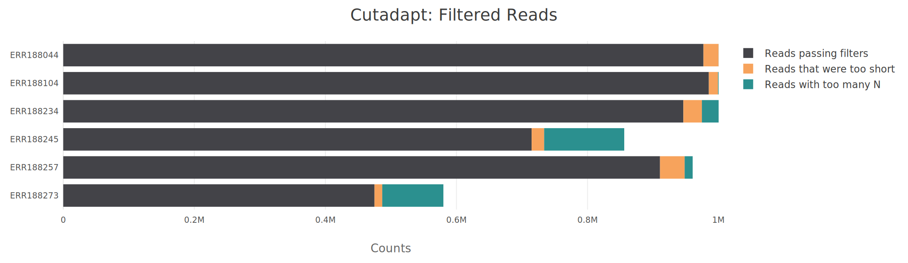

- **Reads Kept:** The large black segments represent the "trimmed" reads that passed all filters.
- **Reads Too Short:** If your sequencing fragments were very small, some reads might be trimmed down to almost nothing. These are discarded to prevent non-specific mapping.
- **Efficiency:** A successful run should show the vast majority of reads being kept, indicating that while adapters were present, the underlying biological sequences remained intact.

#### 2. Trimmed Sequence Lengths

These plots show the distribution of the lengths of the sequences that were removed from your reads.

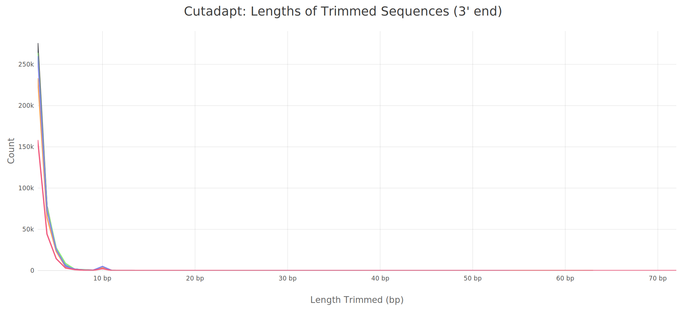

- **Counts Plot:** The peaks represent common lengths of trimmed segments. A peak at the very beginning of the read often corresponds to primer or adapter sequences.
- **Observed vs. Expected:** The "Obs/Exp" plot compares the number of times a sequence was trimmed versus how often you would expect it to happen by chance.

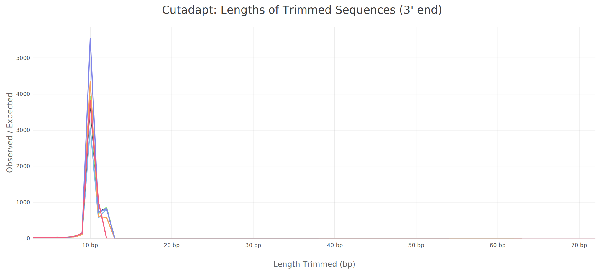

- **Technical Bias:** A sharp spike in the Observed/Expected plot (as seen at the very left) confirms that Cutadapt is removing specific, non-random technical sequences rather than biological variation.

#### 3. Automated Trimming Logic

The pipeline adapts its trimming strategy based on the sequencing platform used:

- **Standard Trimming:** Removes the identified adapter sequences from the 3' ends.
- **NextSeq/NovaSeq Mode:** If your data came from these platforms, a specialized `--nextseq-trim=20` filter is applied. This specifically handles "dark cycles" (G-base calls occurring when the signal is lost) to prevent them from being misinterpreted as biological data.

### FastQC (trimmed)

<details markdown="1">
<summary>Output files</summary>

- `quality_control/fastqc/trimmed/<SAMPLE>/`
  - `<SAMPLE>_trimmed_fastqc.html` – FastQC report for trimmed reads.
  - `<SAMPLE>_trimmed_fastqc.zip` – Zip archive containing the report, data tables and plots for trimmed data.

</details>

[FastQC](http://www.bioinformatics.babraham.ac.uk/projects/fastqc/) provides quality metrics for the processed reads. This step runs after adapter removal and quality filtering to validate the effectiveness of the **trimming** process. For further reading and documentation see the [FastQC help pages](http://www.bioinformatics.babraham.ac.uk/projects/fastqc/Help/).

#### 1. Trimming Validation: Quality & Adapters

The primary goal of this stage is to ensure the "cleaning" process worked without losing critical biological data.

##### Per Base Sequence Quality

This plot shows the Phred score ($Q$) at each position. Post-trimming, you should see the "tails" of the reads clipped where quality previously dropped.
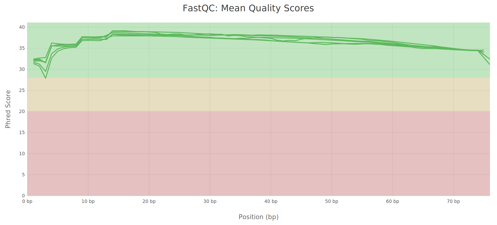

- **Result:** The entire read length now stays within the **green zone ($Q > 30$)**, representing $>99.9\%$ base-calling accuracy.

##### Adapter Content

This is the most direct measure of trimming success.
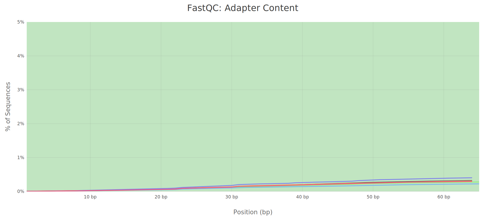

- **Result:** The plot a slight lift here is typical for Poly(A) libraries. It indicates the presence of the 3' tail rather than a failure to trim the synthetic Illumina adapters.

#### 2. Library Composition & Integrity

We expect specific signatures in the sequence composition.

##### Per Sequence GC Content

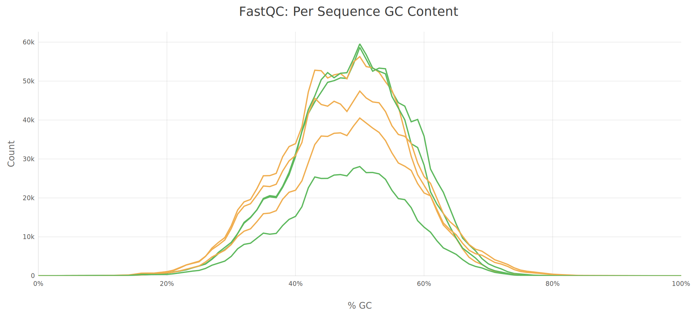

- **Result:** The distribution remains unimodal and smooth. Because you are sequencing the transcriptome (exons) rather than the whole genome, a slight shift in the peak compared to a theoretical genomic distribution is normal for RNA-seq data.

##### Per Base N Content

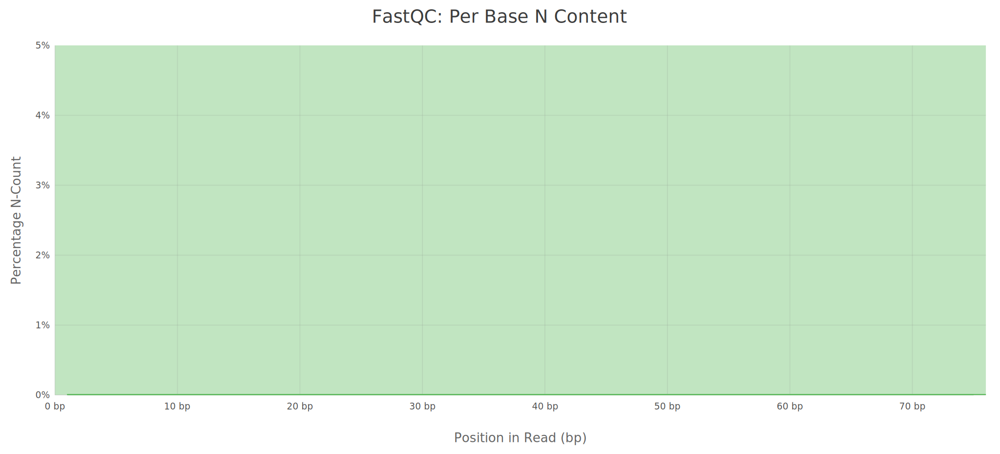

- **Result:** The "N" content remains at **0%**, ensuring no ambiguous bases are passed to the aligner.

#### 3. Sequence Complexity

##### Sequence Counts & Duplication

These metrics help differentiate between a diverse library and one dominated by PCR artifacts.
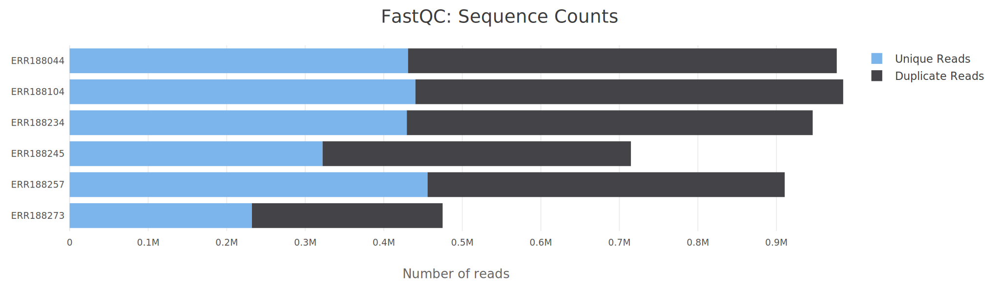
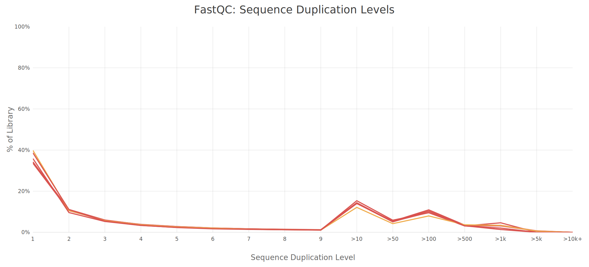

- **Interpretation:** In RNA-seq, "duplicates" are often just high-abundance transcripts (like housekeeping genes). After trimming, we retain a robust set of unique sequences, indicating a high-complexity library.

##### Post-Trimming Summary

| Metric        | Status                 | Biological Significance                                      |
| :------------ | :--------------------- | :----------------------------------------------------------- |
| **Adapters**  | ✅ **Clean**           | Prevents misaligned reads and "soft-clipping" issues.        |
| **Quality**   | ✅ **High ($Q > 30$)** | Ensures high confidence in downstream SNP/variant detection. |
| **N Content** | ✅ **Zero**            | Indicates optimal sequencing and filtering performance.      |

### BBSplit

<details markdown="1">
<summary>Output files</summary>

- `preprocessing/bbsplit/<SAMPLE>/`
  - `<SAMPLE>_primary.fastq.gz` – Reads that map best to the target genome (kept for downstream analysis).
  - `<SAMPLE>_stats.txt` – Statistics on read assignment to each reference.

</details>

When `--contaminant_species` or `--contaminant_fasta` is provided and `--skip_bbsplit` is **not** set, [BBSplit](https://jgi.doe.gov/data-and-tools/bbtools/) bins reads by mapping simultaneously to the target genome and one or more contaminant genomes. Only reads assigned to the target (primary) genome are retained.

#### 1. Contaminant Removal Strategy

BBSplit maps reads to multiple genomes simultaneously. If a read matches the contaminant genome better than the target genome, it is "binned" into the contaminant category and filtered out.

##### Alignment Statistics

The alignment plot visualizes the distribution of reads across your target species versus any identified contaminants.

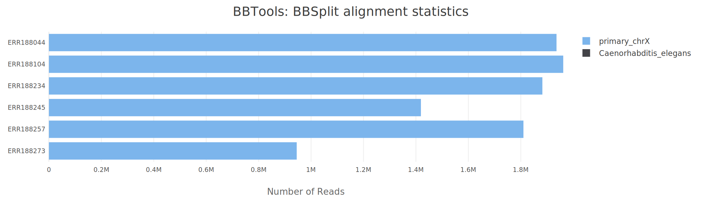

- **Primary Genome (Blue):** These are the reads that mapped successfully and uniquely to your target organism. These are the only reads retained for downstream analysis.
- **Contaminants (Black):** This segment represents reads assigned to the species provided via `--contaminant_species` (e.g., Mycoplasma, E. coli, or common lab contaminants).
- **Unmapped:** Reads that did not meet the alignment threshold for any of the provided genomes.

#### 2. BBSplit Data Summary

The statistics table provides the exact count and percentage of the data that survived the filtering process.

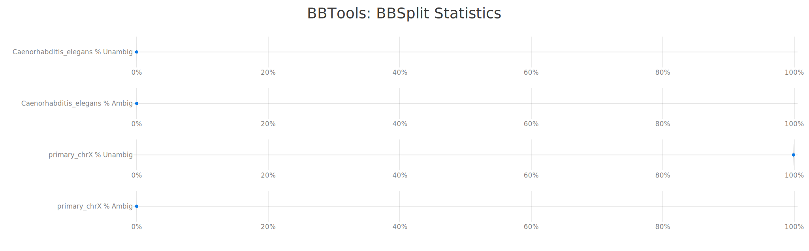

- **Mapping Yield:** In a high-quality experiment, the "Primary" percentage should be very high (typically >90%).
- **Contamination Level:** If a specific sample shows a large spike in the "Contaminant" percentage, it may indicate a sample prep issue or biological contamination that could skew your downstream results.

---

### SortMeRNA

<details markdown="1">
<summary>Output files</summary>

- `preprocessing/sortmerna/<SAMPLE>/`
  - `<SAMPLE>_non_rRNA.fq.gz` – FASTQ file with ribosomal RNA reads removed.
  - `<SAMPLE>.log` – SortMeRNA log file.

</details>

When `--skip_sortmerna` is **not** set, [SortMeRNA](https://github.com/biocore/sortmerna) filters out rRNA sequences using a comprehensive database (SILVA/RFAM). The cleaned reads proceed to alignment.

#### Detailed Alignment Statistics

The plot below illustrates the ratio of rRNA found in each sample.

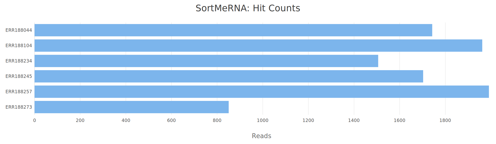

- **rRNA (Blue Color):** These segments represent the specific types of ribosomal RNA identified. In an RNA-Seq library, these should ideally be very small or nearly invisible.

---

### Strandedness inference

When any sample in the samplesheet has `lib_type = auto`, the pipeline subsamples 1 million reads and runs Salmon in `--skipQuant` mode to infer library strandedness. No output files are published; the inferred strandedness is automatically used for all downstream steps.

---

## Alignment & Quantification

The output directories depend on the chosen aligner or pseudo‑aligner. All files for a given route are placed under a single top‑level directory (e.g., `alignment/hisat2/`, `quantification/kallisto/`).

### HISAT2 alignment & featureCounts

<details markdown="1">
<summary>Output files</summary>

- `alignment/hisat2/<SAMPLE>/`
  - `<SAMPLE>.bam` – Sorted BAM file of genomic alignments.
  - `<SAMPLE>.summary` – HISAT2 alignment summary.

- `quantification/featurecounts/<SAMPLE>/`
  - `<SAMPLE>.counts.txt` – featureCounts gene‑level count table.
  - `<SAMPLE>.counts.txt.summary` – Summary statistics of assignment.
- `quantification/merged_matrices/`
  - `merged_counts.rds` – A consolidated gene-level count matrix generated by merging multiple individual **featureCounts**

</details>

[HISAT2](http://daehwankimlab.github.io/hisat2/) is a splice‑aware aligner for genomic RNA‑seq data. The resulting BAM files are sorted and indexed. Subsequently, [featureCounts](http://bioinf.wehi.edu.au/featureCounts/) generates gene‑level raw counts using the provided annotation (GTF), which are then merged into a single matrix for differential expression analysis.

#### 1. HISAT2 Alignment Statistics

HISAT2 is a splice-aware aligner, meaning it can map reads that span across introns—a critical feature for mRNA data.

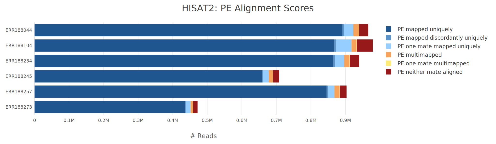

- **Aligned Uniquely (Deep Blue):** These are reads that map to exactly one location in the genome. High unique mapping rates (typically >80%) indicate a high-quality library and a well-matched reference genome.
- **Aligned Multi-mapped (Light Blue):** Reads that map to multiple locations (e.g., paralogous genes or repetitive regions).
- **Not Aligned (Red):** These reads did not match the reference. In an RNA-Seq data, a small percentage of unmapped reads is expected, but large amounts could suggest contamination or significant residual adapters.

#### 2. featureCounts Assignment

Once aligned, **featureCounts** determines if those mapped reads actually overlap with the genomic coordinates of known genes (exons) provided in your GTF file.

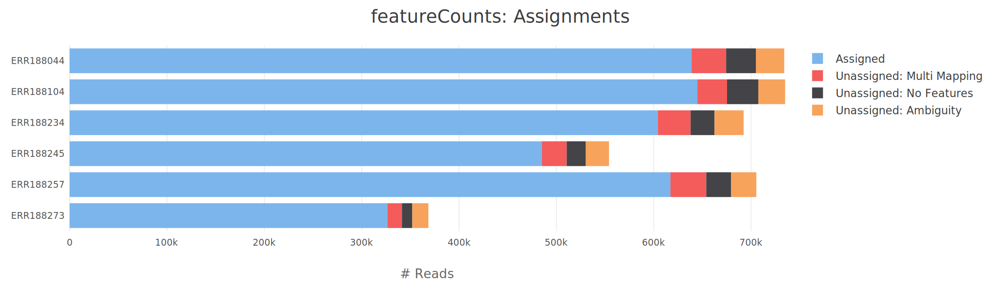

- **Assigned (Blue):** These reads successfully overlapped with an exon and will be used to build your final count matrix.
- **Unassigned_NoFeatures (Black):** These reads mapped to the genome but not to a known gene (e.g., intronic or intergenic regions). In an RNA-Seq library, this should be relatively low since you've enriched for mature mRNA.
- **Unassigned_Ambiguity (Orange):** Reads that overlap with more than one gene, making it impossible to tell which one they belong to.

---

### Salmon pseudoalignment

<details markdown="1">
<summary>Output files</summary>

- `quantification/salmon/<SAMPLE>/`
  - `quant.sf` – Transcript‑level abundance estimates (TPM, estimated counts, effective length).
  - `aux_info/` – Directory containing auxiliary files (e.g., meta_info.json, ambig_info.tsv).
  - `logs/` – Log files from Salmon.

- `quantification/merged_matrices/`
  - `tx2gene.tsv` – Transcript‑to‑gene mapping.
  - `tximport_results.rds` – gene-level abundance and counts summarized from transcript-level data via **tximport**.

</details>

[Salmon](https://combine-lab.github.io/salmon/) performs quasi‑mapping and quantification directly on the transcriptome. Results are aggregated across samples with [tximport](https://bioconductor.org/packages/release/bioc/html/tximport.html) to produce gene‑ and transcript‑level matrices suitable for downstream differential analysis.

#### 1. Fragment Length Distribution

The Salmon plot visualizes the estimated distribution of fragment lengths across your samples. This is a key indicator of library preparation quality.

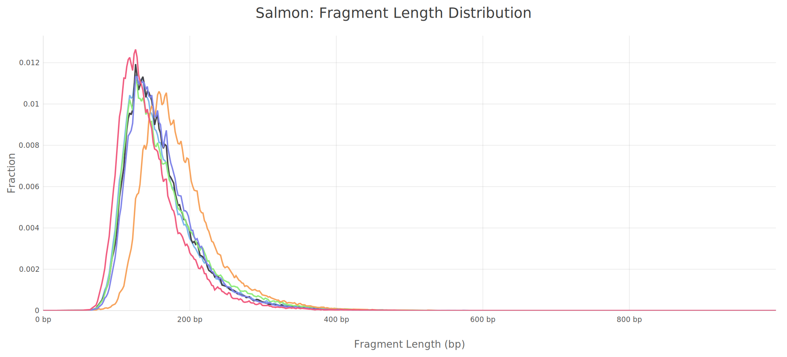

- **Consistency:** The overlapping curves indicate high consistency between your biological replicates.
- **Peak Position:** The peak of these curves (typically between 200–300 bp) represents the average size of the cDNA fragments generated during library prep.

#### 2. Quasi-Mapping and Quantification

Salmon doesn't perform a base-to-base alignment. Instead, it breaks reads into $k$-mers and matches them to the transcriptome.

- **Handling Poly(A) Tails:** Salmon is robust against the residual poly(A) tails. Because it targets the transcriptome directly, any trailing "A"s that don't match the transcript are effectively ignored during the quasi-mapping phase.
- **Bias Correction:** Salmon automatically corrects for several common RNA-seq biases, including:
  - **Sequence Bias:** Correcting for preferences in random hexamer priming.
  - **GC Content Bias:** Crucial for Poly(A) data where certain transcripts might be over-represented due to their GC makeup.

---

### Kallisto pseudoalignment

<details markdown="1">
<summary>Output files</summary>

- `quantification/kallisto/<SAMPLE>/`
  - `abundance.h5` – HDF5 file containing run info and bootstrap estimates.
  - `abundance.tsv` – Plain‑text abundance table (TPM, estimated counts, effective length).
  - `run_info.json` – Run metadata.
  - `kallisto_quant.log` – Log file.
- `quantification/merged_matrices/`
  - `tx2gene.tsv` – Transcript‑to‑gene mapping.
  - `tximport_results.rds` – gene-level abundance and counts summarized from transcript-level data via **tximport**.

</details>

[Kallisto](https://pachterlab.github.io/kallisto/) is an ultra‑fast pseudoaligner. The output matrices are produced in the same format as Salmon for easy comparison.

#### 1. Kallisto Alignment Statistics

The alignment plot shows how many of your processed reads were successfully assigned to the transcriptome.

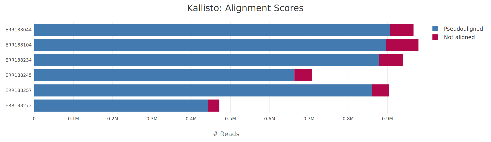

- **Pseudoaligned (Blue):** These are the reads that were successfully mapped to one or more transcripts in your reference transcriptome.
- **Not Aligned (Red):** These reads did not match any known transcripts. In your data, this fraction is quite low, which is an excellent indicator of library purity and transcriptome completeness.

#### 2. Pseudoalignment vs. Traditional Mapping

Kallisto’s algorithm is particularly suited for large-scale time-course experiments like yours:

- **Speed:** It can quantify millions of reads in minutes, making it easy to re-run if you update your gene annotations.
- **Isoform Resolution:** By looking at $k$-mer sets, it can often resolve which specific splice variant a read came from, which is vital for the **splicing analysis** you are performing.
- **Quantification:** Like Salmon, it produces estimated counts and TPM (Transcripts Per Million), which are then aggregated by `tximport` for your downstream analysis.

#### 3. Comparison with Salmon Results

Since Kallisto and Salmon use different mathematical models (pseudoalignment vs. quasi-mapping), comparing them is a standard way to ensure your results are robust.

| Feature              | Salmon                        | Kallisto                        |
| :------------------- | :---------------------------- | :------------------------------ |
| **Mapping Method**   | Quasi-mapping (mapping-based) | Pseudoalignment ($k$-mer based) |
| **Poly(A) Handling** | Sequence-match filtering      | $k$-mer compatibility           |
| **Output**           | TPM & Estimated Counts        | TPM & Estimated Counts          |
| **Performance**      | Extremely Fast                | Ultra Fast                      |

## Post‑alignment processing

These steps are executed only for the **HISAT2 route** (except UMI‑dedup, which also works on BAM files from HISAT2).

### SAMtools sort/index

<details markdown="1">
<summary>Output files</summary>

- `alignment/native/<SAMPLE>/`
  - `<SAMPLE>.bam` – Coordinate‑sorted BAM file.
  - `<SAMPLE>.bam.bai` – BAI index.

</details>

[SAMtools](http://www.htslib.org/) sorts the raw HISAT2 BAM and creates an index for rapid access.

### UMI‑tools dedup

<details markdown="1">
<summary>Output files</summary>

- `alignment/deduplicated/<SAMPLE>/`
  - `<SAMPLE>.umi_dedup.bam` – BAM after UMI‑based deduplication.
  - `<SAMPLE>.umi_dedup.bam.bai` – Index.
  - `<SAMPLE>_edit_distance.tsv` – Edit distance distribution between UMIs.
  - `<SAMPLE>_per_umi.tsv` – Per‑UMI statistics.
  - `<SAMPLE>_per_position.tsv` – Counts per position per UMI.
  - `<SAMPLE>.log` – UMI-tools dedup log.

</details>

When `--with_umi` is used, [UMI‑tools dedup](https://umi-tools.readthedocs.io/) collapses reads that originate from the same original molecule using UMI sequences and mapping coordinates.

#### 1. UMI Deduplication Performance

The deduplication process compares the UMI sequence and the mapping coordinates of every read. If two reads have the same UMI and map to the same genomic location, they are collapsed into a single "unique" count.

##### Deduplication Counts

This plot shows the "before and after" of your read counts.

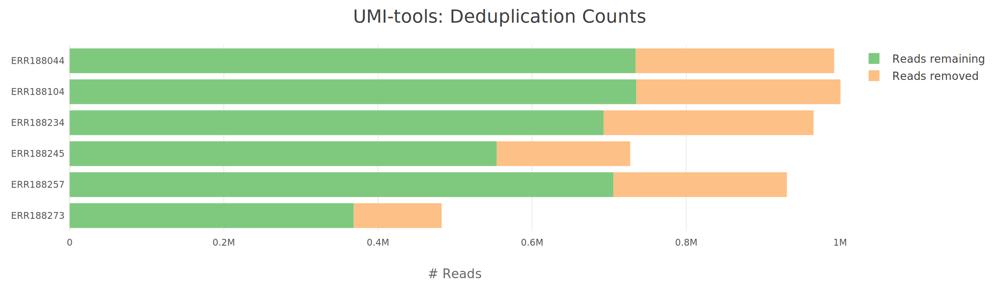

- **Reads Remaining (Green):** The number of unique biological molecules identified after deduplication.
- **Reads Removed (Orange):** The number of duplicate reads removed during the deduplication step.
- **Interpretation:** In UMI-based RNA-seq libraries, reads derived from the same original molecule are identified by their unique molecular identifiers (UMIs) and collapsed into a single count. The reads **removed (orange)** represent PCR duplicates sharing identical UMIs, while the **reads remaining (green)** correspond to unique transcriptional events.

#### 2. UMI Statistics and Distribution

The violin plots visualize the distribution of UMIs across your samples, helping to identify potential biases in library complexity.

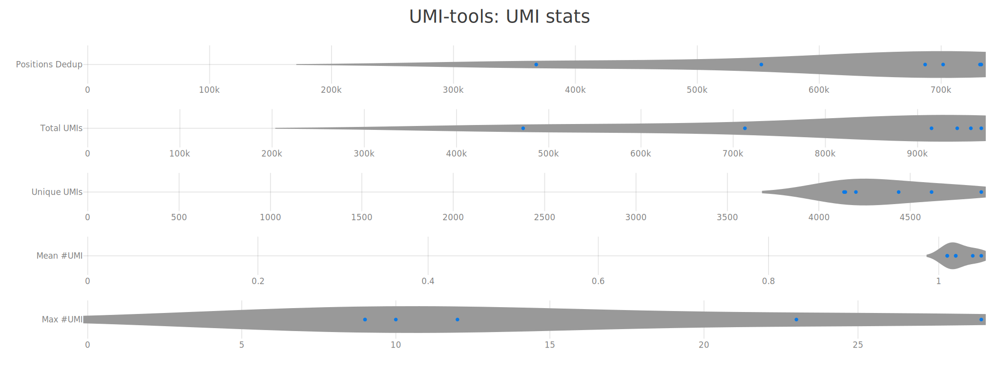

- **Mean UMI per Position:** This indicates how many times a unique molecule was typically sequenced.
- **Library Complexity:** A narrow, consistent violin across samples suggests that your PCR amplification was uniform across your control and treated groups. If one sample had a much higher "bulge" in the violin, it might indicate over-amplification, which could skew your downstream results.

#### 3. Impact on Downstream Analysis

By performing UMI deduplication, you are ensuring that your quantitative results are based on **molecular counts** rather than **read counts**.

- **Differential Expression:** Reduces the "noise" caused by PCR bias, leading to more accurate Fold-Change calculations in **limma** and **DESeq2**.
- **Splicing Accuracy:** Ensures that the junction counts used for **rMATS** represent real alternative splicing events rather than amplified technical errors.

---

## Germline Variant Calling (GVC)

This subworkflow is activated when `--aligner hisat2` is used and `--analysis_method` includes `GVC`. It follows GATK Best Practices for RNA‑seq variant calling.

### Picard MarkDuplicates

<details markdown="1">
<summary>Output files</summary>

- `preprocessing/picard_metrics/`
  - `<SAMPLE>.MarkDuplicates.metrics.txt` – Picard MarkDuplicates metrics report.

</details>

When `--skip_picard_markduplicates` is **not** set, [Picard MarkDuplicates](https://broadinstitute.github.io/picard/) marks optical and PCR duplicates. The metrics file contains duplication statistics.

#### 1. Deduplication Statistics

The Picard plot visualizes the proportion of your library that consists of duplicate reads versus unique observations.

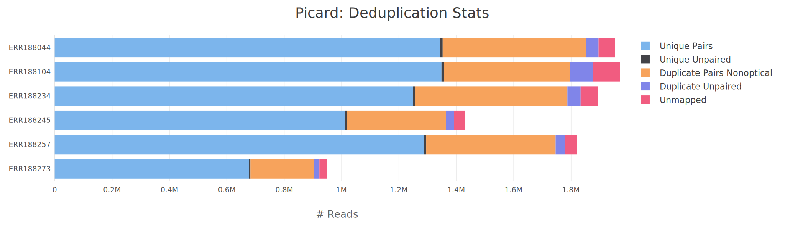

- **Unique Reads (Blue):** These are the high-value reads that map to distinct genomic locations. In a healthy Poly(A) library, this should represent the vast majority of your data.
- **Duplicate Reads (Orange):** These reads map to the exact same start and end coordinates as another read.

#### 2. PCR vs. Optical Duplicates

Picard distinguishes between two main types of technical duplicates:

- **PCR Duplicates:** These occur during library amplification. If the ratio of orange to blue is very high, it suggests your library was "over-amplified" due to low initial RNA input.
- **Optical Duplicates:** These are artifacts of the sequencing flow cell, where a single cluster is incorrectly read as two adjacent ones. Modern patterned flow cells (like NovaSeq) have specific patterns to minimize this.

---

### GATK4 SplitNCigarReads, BaseRecalibrator, ApplyBQSR

<details markdown="1">
<summary>Output files</summary>

- `preprocessing/split_ncigar_bam/`
  - `<SAMPLE>.splitncigarreads.bam` – BAM after SplitNCigarReads.

- `preprocessing/recalibration_tables/`
  - `<SAMPLE>.baserecalibrator.table` – Recalibration table.

</details>

These GATK4 tools prepare the RNA‑seq alignments for variant calling by splitting reads at N cigar operators, recalibrating base qualities, and generating a recalibrated BAM (if `--skip_baserecalibration` is **not** set).

#### 1. Splitting Reads (SplitNCigarReads)

- **The "N" Operator:** In a BAM file, the "N" operator represents the gap (intron) between exons.
- **The Process:** GATK splits these "spliced" reads into separate segments. This prevents variant callers from misinterpreting the gaps as massive deletions and improves the accuracy of mapping at exon-intron boundaries.

#### 2. Base Quality Score Recalibration (BQSR)

The sequencer assigns a quality score to every base, but these are often systematically biased. BQSR uses machine learning to adjust these scores so they reflect the true probability of error.

##### Reported vs. Empirical Quality

This plot shows the "calibration" of the sequencer's estimations.
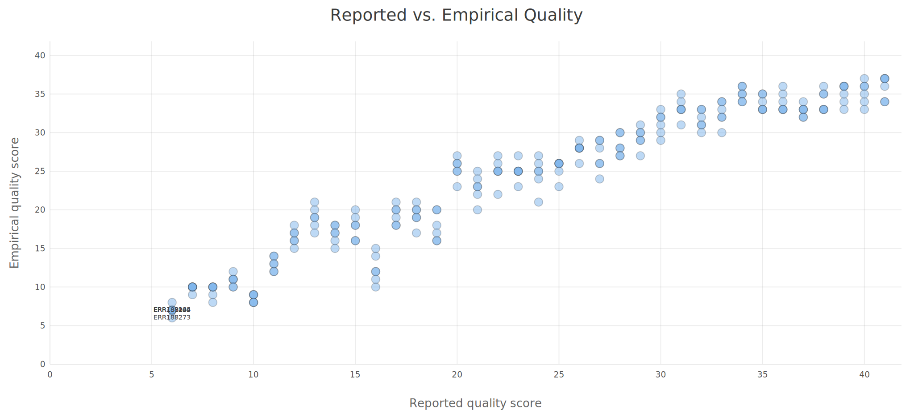

- **Interpretation:** The closer the dots are to the diagonal line, the more accurate the sequencer's reported scores are.
- **The Benefit:** If the "Reported" score is 30 but the "Empirical" (actual) score is 25, BQSR will down-weight that base. This prevents "false positive" variant calls that might otherwise appear significant in your variant calling analysis.

---

#### 3. Pre-Recalibration Quality Distribution

This plot visualizes the counts of different quality scores across your samples before the BQSR adjustments are applied.
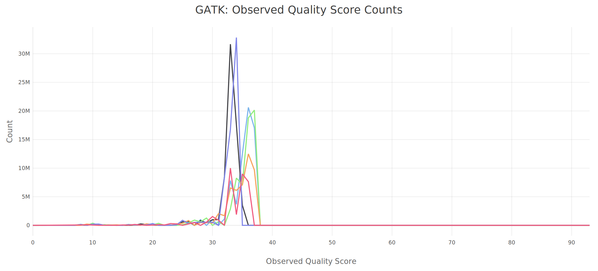

- **High-Quality peaks:** You should see a strong peak at higher Phred scores (e.g., Q30+).

---

#### 4. Impact on Variant Calling

By the time you reach the final recalibrated BAM:

- **False Positives are Reduced:** Systematic errors from the flow cell or chemistry are corrected.
- **Splice Site Accuracy:** Splitting reads ensures that variants near the edges of exons are not missed or miscalled.
- **Reliable Indels:** Recalibration helps distinguish between true insertions/deletions and sequencing "stutters."

##### GATK Preparation Summary

| Step                 | Action                     | Benefit for RNA-seq                                   |
| :------------------- | :------------------------- | :---------------------------------------------------- |
| **SplitNCigar**      | Splitting reads at introns | Accurate mapping across splice junctions.             |
| **BQSR (Model)**     | Identifying bias           | Corrects systematic sequencing errors.                |
| **Recalibrated BAM** | Adjusting Phred scores     | Provides the most accurate input for HaplotypeCaller. |

### HaplotypeCaller

<details markdown="1">
<summary>Output files</summary>

HaplotypeCaller runs on each individual replicate, but the resulting VCF files are **intermediate and not published** by default. They are passed directly to the merging step.

</details>

[HaplotypeCaller](https://gatk.broadinstitute.org/hc/en-us/articles/5358864757787-HaplotypeCaller) calls SNPs and indels on each individual replicate, outputting raw results (if `--skip_variantfiltration` is set). These raw VCF files are temporary and are immediately used for merging by condition.

### BCFtools merge

<details markdown="1">
<summary>Output files</summary>

- `variant_calling/raw_vcf/`
  - `<CONDITION>.merged.haplotypecaller.vcf.gz` – Merged VCF combining all replicates for a given condition.
  - `<CONDITION>.merged.haplotypecaller.vcf.gz.tbi` – Tabix index.

</details>

[BCFtools merge](https://samtools.github.io/bcftools/bcftools.html#merge) combines the individual replicate VCFs within each condition. This increases variant detection power by consolidating evidence across biological replicates.

> [!NOTE]  
> The condition name (e.g., `control`, `treated`) is derived from the `condition` column in the input samplesheet. All replicates sharing the same condition are merged into a single VCF per condition.

### VariantFiltration

<details markdown="1">
<summary>Output files</summary>

- `variant_calling/filtered_vcf/`
  - `<CONDITION>.haplotypecaller.filtered.vcf.gz` – Filtered VCF for each condition after hard filtering.
  - `<CONDITION>.haplotypecaller.filtered.vcf.gz.tbi` – Tabix index.

</details>

[VariantFiltration](https://gatk.broadinstitute.org/hc/en-us/articles/5358912683419-VariantFiltration) applies hard filters based on FS, QD, and cluster size to produce the final filtered VCF (if `--skip_variantfiltration` is **not** set).

> [!NOTE]
> If `--skip_variantfiltration` is set, the raw merged VCFs are used directly for downstream analysis. Otherwise, the filtered VCFs are produced and published in the `filtered_vcf/` directory.

### BCFtools isec (Condition‑Specific Variant Analysis)

<details markdown="1">
<summary>Output files</summary>

- `variant_calling/intersection/`
  - `<CONDITION1>_unique.vcf.gz` (and `.tbi`) – Variants unique to the first condition/sample (not present in control).
  - `<CONDITION2>_unique.vcf.gz` (and `.tbi`) – Variants unique to the second condition/sample.
  - `<CONDITION1>_common.vcf.gz` (and `.tbi`) – Variants common to both samples (present in condition1).
  - `<CONDITION2>_common.vcf.gz` (and `.tbi`) – Variants common to both samples (present in condition2).
  - `README.txt` – Updated description of which file corresponds to which sample combination.
  - `sites.txt` – List of genomic positions and their presence/absence across samples.

> **File naming convention:**
>
> - `<CONDITION>` is derived from the sample/condition names provided in the input samplesheet.
> - `_unique.vcf.gz` – Variants present only in that specific condition.
> - `_common.vcf.gz` – Variants present in both conditions (shared variants).

</details>

[BCFtools isec](https://samtools.github.io/bcftools/bcftools.html#isec) performs intersection analysis on the two filtered condition VCFs. The pipeline automatically renames the default 0000-0003.vcf.gz outputs to descriptive names based on the condition labels from your samplesheet.

> [!TIP]  
> The `_unique.vcf.gz` files contain variants specific to a single condition. In a control vs. experimental design, the condition labeled as "control" in your samplesheet produces `control_unique.vcf.gz` (variants found only in controls), while the experimental condition produces `experimental_unique.vcf.gz` (variants found only in experimental samples). The **experimental unique variants** are the primary candidates for condition‑specific biological effects and are subsequently used for functional annotation with SnpEff.

### SnpEff annotation

<details markdown="1">
<summary>Output files</summary>

- `variant_calling/annotated_vcf/`
  - `<CONDITION>.snpeff.ann.vcf` – Annotated VCF for each condition
  - `<EXPERIMENTAL_CONDITION>_absent_in_control.snpeff.ann.vcf` – Annotated VCF for variants **unique to the experimental condition** (present in experimental samples but absent in controls). This is the primary output for identifying condition-specific functional variants.

- `variant_calling/reports/snpeff/<CONDITION>/`
  - `<CONDITION>.snpeff.csv` – Summary statistics for each condition.
  - `<CONDITION>.snpeff.html` – HTML report for each condition.
  - `<CONDITION>.snpeff.genes.txt` – Gene‑level summary for each condition.

- `variant_calling/reports/snpeff/<EXPERIMENTAL_CONDITION>_absent_in_control/`
  - `<EXPERIMENTAL_CONDITION>_absent_in_control.snpeff.csv` – Summary statistics for experimental-unique variants.
  - `<EXPERIMENTAL_CONDITION>_absent_in_control.snpeff.html` – HTML report for experimental-unique variants.
  - `<EXPERIMENTAL_CONDITION>_absent_in_control.snpeff.genes.txt` – Gene‑level summary for genes harboring experimental-unique variants.

</details>

[SnpEff](http://snpeff.sourceforge.net/) adds functional annotations to VCF files at **three levels**:

1. **Each merged condition**: All variants present across replicates for a given condition are annotated, providing a baseline of variant effects for both control and experimental groups.
2. **Experimental-unique variants**: Following `BCFtools isec` analysis, variants that are **unique to the experimental condition** (present in experimental samples but absent in all controls) are annotated as a consolidated set. This is the **key output** for:
   - Identifying condition-specific variants with high functional impact
   - Prioritizing variants most likely to be associated with the experimental perturbation
   - Focused downstream analysis on biologically relevant mutations

This targeted approach ensures that researchers can examine variant effects across all conditions while focusing specifically on the most biologically relevant, condition-specific variants for the experimental group.

#### Variant Distribution by Region

The following plots illustrate where your identified variants are located relative to gene structures.

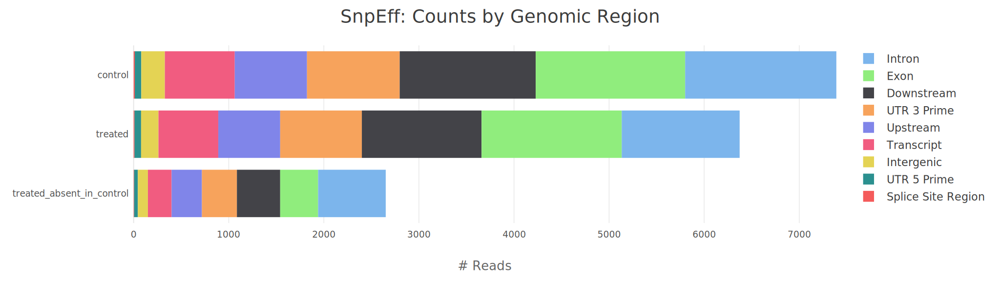

- **Exonic Variants:** In RNA-seq data, we expect a high density of variants in exons. These are high-priority as they can directly change the amino acid sequence of the resulting protein.
- **Intronic & Intergenic:** While Poly(A) selection targets mature mRNA, residual pre-mRNA or genomic DNA can lead to intronic calls. However, variants in these regions can also represent regulatory elements or non-coding RNAs.
- **Log Scale Visualization:** The log plot is particularly useful for identifying rare but high-impact events in regions that are otherwise sparse.

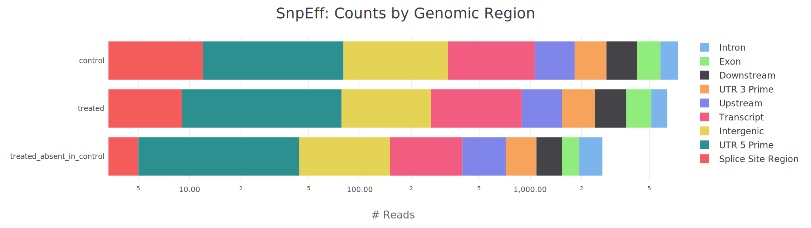

---

## Differential Analysis

Depending on the value of `--analysis_method`, the pipeline runs one or more of the following modules. Outputs are organized under `differential_analysis/`.

### rMATS (Alternative Splicing)

<details markdown="1">
<summary>Output files</summary>

- `differential_analysis/rmats/`
  - `results/rmats_post_output/`
    - `SE.MATS.JC.txt`, `SE.MATS.JCEC.txt` – Results for **Skipped Exon** events.
    - `RI.MATS.JC.txt`, `RI.MATS.JCEC.txt` – Results for **Retained Intron** events.
    - `MXE.MATS.JC.txt`, `MXE.MATS.JCEC.txt` – Results for **Mutually Exclusive Exon** events.
    - `A5SS.MATS.JC.txt`, `A5SS.MATS.JCEC.txt` – Results for **Alternative 5’ Splice Site** events.
    - `A3SS.MATS.JC.txt`, `A3SS.MATS.JCEC.txt` – Results for **Alternative 3’ Splice Site** events.
    - `summary.txt` – A summary of the number of events and significant results for each category.
    - `fromGTF.SE.txt`, `fromGTF.RI.txt`, `fromGTF.MXE.txt`, `fromGTF.A5SS.txt`, `fromGTF.A3SS.txt` – All events identified using the reference annotation.
    - `fromGTF.novelJunction.SE.txt`, `fromGTF.novelJunction.RI.txt`, `fromGTF.novelJunction.MXE.txt`, `fromGTF.novelJunction.A5SS.txt`, `fromGTF.novelJunction.A3SS.txt` – Events containing junctions not found in the GTF.
    - `fromGTF.novelSpliceSite.SE.txt`, `fromGTF.novelSpliceSite.RI.txt`, `fromGTF.novelSpliceSite.MXE.txt`, `fromGTF.novelSpliceSite.A5SS.txt`, `fromGTF.novelSpliceSite.A3SS.txt` – Events involving novel splice sites.
    - `JC.raw.input.SE.txt`, `JC.raw.input.RI.txt`, `JC.raw.input.MXE.txt`, `JC.raw.input.A5SS.txt`, `JC.raw.input.A3SS.txt` – Raw junction count inputs.
    - `JCEC.raw.input.SE.txt`, `JCEC.raw.input.RI.txt`, `JCEC.raw.input.MXE.txt`, `JCEC.raw.input.A5SS.txt`, `JCEC.raw.input.A3SS.txt` – Raw junction and exon count inputs.
    - `tmp/` – Directory containing intermediate binary files used for calculations.
  - `results/rmats_prep_tmp/`
    - `*.rmats` – Binary/intermediate records used for calculating splicing statistics.
    - `read_outcomes_by_bam.txt` – Summary of how many reads from each BAM file were used or excluded.
  - `filtered/`
    - `<EVENT_TYPE>.filtered.txt` – Splicing events that have passed significance (FDR), magnitude ($|\Delta\Psi|$), read coverage, and inclusion level thresholds.
  - `sashimi_<EVENT_TYPE>_out/`
    - `Sashimi_plot/` – **The primary results folder.** Contains the actual PDF visualizations named by gene and genomic coordinates (e.g., `1_MORF4L2_chrX...pdf`).
    - `Sashimi_index/` – Contains the `events_file.txt` and event lists used by the tool to keep track of which specific splicing junctions are being plotted.
    - `Sashimi_index_<GENE>_<ID>/` – Internal processing directories for each individual plot. These contain:
      - `*.pickle` – Serialized data of the splicing event.
      - `genes.gff` / `tmp.gff3` – Temporary annotation snippets for the specific gene region.
      - `sashimi_plot_settings.txt` – The specific coordinates and colors used for that individual plot.
      - `*.shelve` files – Python database files used for rapid mapping of IDs to gene names during plot generation.

</details>

[rMATS](http://rnaseq-mats.sourceforge.net/) detects differential alternative splicing events between groups. The `JC` files prioritize junction reads for higher confidence, while `JCEC` includes reads crossing the exon body. Significant events are prioritized in the `filtered/` directory, with visual validation provided by Sashimi plots.

#### 1. Global Splicing Overview

[rMATS](http://rnaseq-mats.sourceforge.net/) detects differential alternative splicing events between groups. The `JC` files prioritize junction reads for higher confidence, while `JCEC` includes reads crossing the exon body. Significant events are prioritized in the `filtered/` directory.

**From summary.txt:**

```text
EventType  EventTypeDescription         TotalEventsJC  TotalEventsJCEC  SignificantEventsJC  SigEventsJCSample1HigherInclusion  SigEventsJCSample2HigherInclusion  SignificantEventsJCEC  SigEventsJCECSample1HigherInclusion  SigEventsJCECSample2HigherInclusion
SE         skipped exon                 1920           2070             9                    5                                  4                                  21                     11                                   10
A5SS       alternative 5' splice sites  392            400              1                    1                                  0                                  7                      2                                    5
A3SS       alternative 3' splice sites  736            738              5                    2                                  3                                  5                      2                                    3
MXE        mutually exclusive exons     355            397              0                    0                                  0                                  2                      2                                    0
RI         retained intron              361            370              13                   5                                  8                                  20                     7                                    13
```

- **Key Insight:** The summary shows that **Retained Introns (RI)** and **Skipped Exons (SE)** are the primary drivers of differential splicing in this dataset, with 13 and 9 significant events respectively (JC).

---

#### 2. Statistical Analysis of Skipped Exons

The quantitative data allows for a gene-level inspection of splicing changes, focusing on the inclusion levels across replicates.

**From SE.MATS.JC.txt:**

```text
ID  GeneID             geneSymbol  chr   strand  exonStart_0base  exonEnd   upstreamES  upstreamEE  downstreamES      ID  IJC_S1  SJC_S1  IJC_S2  SJC_S2  IncLen  SkipLen  PValue  FDR    IncLevel1      IncLevel2      IncLevelDiff
1   "ENSG00000165591"  "FAAH2"     chrX  +       57331597         57331807  57310592    57310729    5737865057378786  1   1,5,4   1,0,0   3,1,5   0,0,0   150     75       1       1.0    0.333,1.0,1.0  1.0,1.0,1.0    -0.222
2   "ENSG00000165591"  "FAAH2"     chrX  +       57341270         57341390  57310592    57310729    5737865057378786  2   1,10,2  1,0,0   5,1,0   0,0,0   150     75       1       1.0    0.333,1.0,1.0  1.0,1.0,NA     -0.222
3   "ENSG00000165591"  "FAAH2"     chrX  +       57341270         57341390  57331597    57331807    5737865057378786  3   2,17,3  0,0,1   7,1,2   0,0,0   150     75       1       1.0    1.0,1.0,0.6    1.0,1.0,1.0    -0.133
```

- **Gene Focus:** Genes like _FAAH2_ show varying inclusion levels, though in this preliminary head snippet, the FDR values indicate these specific rows are below the significance threshold.

---

#### 3. Visual Validation via Sashimi Plots

Visual validation is provided by Sashimi plots, which map read density and junction connectivity directly to the genomic coordinates.

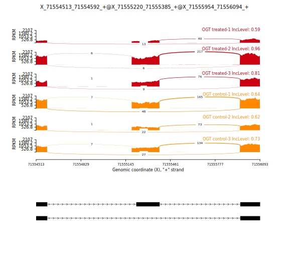

**Results Interpretation:**

- **Experimental Tracks:** The top three red tracks (**Treated**) show distinct read peaks and junction arcs for the middle exon.
- **Comparative Evidence:** Replicate **Treated-2** exhibits a high Inclusion Level (**0.96**) with **217** junction reads supporting the inclusion of the target exon, contrasted against the more balanced profiles in the **Control** tracks (orange).
- **Conclusion:** This visual data confirms a preference for exon inclusion in the OGT gene under treated conditions.

---

### DEXSeq (Differential Exon Usage)

<details markdown="1">
<summary>Output files</summary>

- `differential_analysis/dexseq/counts/<SAMPLE>/`
  - `<SAMPLE>.counts.txt` – Exon‑level counts (generated by DEXSeq‑count).
- `differential_analysis/dexseq/results/`
  - `DEXSeq_table.csv` – Complete results for all tested exons.
  - `significant_DEUs.csv` – Exons passing the FDR and Log2FC thresholds.
  - `significant_DEU_gene_ids.rds` – R object containing unique IDs of genes with significant DEU.
  - `top_DEU_plots/`
    - `DEXSeq_<GENE_ID>_plot.pdf` – Multi-page PDF for each top gene containing:
      - **Exon usage** (fitted models).
      - **Normalized counts** (expression per exon).
      - **Splicing** (relative exon usage).
    - `DEXSeqReport/` – Interactive HTML report generated by DEXSeqHTML (if significant genes are found).
    - `<SAMPLE>.clean.txt` – Formatted count files used as input for the analysis.
  - `GO_results/` – GO enrichment results (if `--enrichment_method` includes GO).
  - `KEGG_results/` – KEGG enrichment results (if `--enrichment_method` includes KEGG).

</details>

[DEXSeq](https://bioconductor.org/packages/release/bioc/html/DEXSeq.html) tests for differential exon usage. Results include interactive HTML reports and gene-level diagnostic plots (if significant genes are found). Additionally, enrichment analyses are performed on genes containing significant exons (if `--enrichment_method` includes **GO** or **KEGG**).

#### 1. MA Plot Interpretation

The MA plot provides a global view of the relationship between mean expression and the log2 fold change of exon usage.

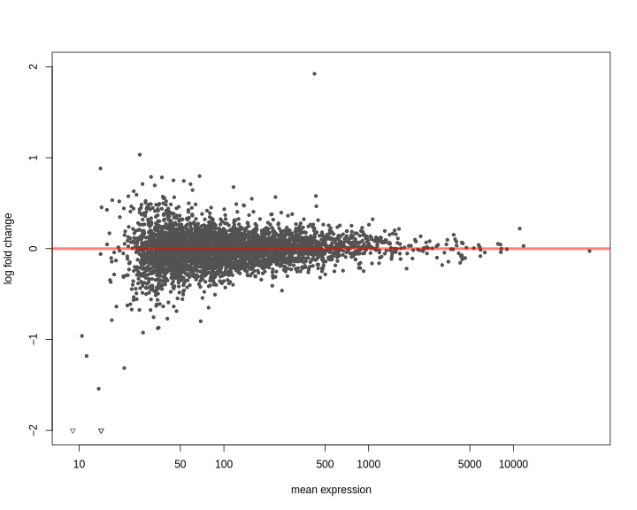

- **X-axis (Mean Expression):** Shows the average normalized count for each exon.
- **Y-axis (Log2 Fold Change):** Shows the change in exon usage between groups.
- **The Trend:** Most points cluster around the **0 line**, indicating that the majority of exons do not show differential usage. Outliers (the scattered points further from the 0 line) represent potential candidates for alternative splicing or specific exon regulation.

---

#### 2. Statistical Table (`DEXSeq_table.csv`)

This table provides the raw metrics for every "exon bin" (feature_id) within a gene (group_id).

```text
"group_id","feature_id","log2_fc","pvalue","padj"
"ENSG00000001497","E039",0.413,0.102,0.999
```

- **feature_id:** Represents the specific exon bin being tested.
- **log2_fc:** The magnitude of change. Positive values indicate higher usage in the treated group; negative values indicate higher usage in the control.
- **padj (Adjusted P-value):** This is the most critical column. For an exon to be considered significantly differential, the `padj` should typically be **< 0.05**. In this snippet, the values (0.99) indicate these specific exons are not significantly changed.

---

#### 3. Gene-Level Diagnostic Plots

When significant genes are identified, DEXSeq generates expression plots to visualize exactly where the usage shifts.

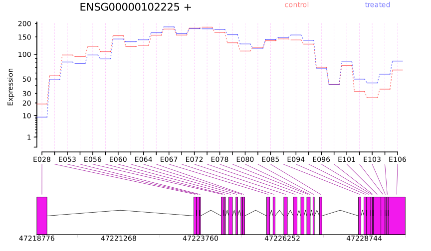

##### How to read this plot:

1.  **Expression Tracks:** The top graph shows normalized counts for each exon bin ($E028$ through $E106$). The **red line** represents Control, and the **blue line** represents Treated.
2.  **Differential Usage:** Look for areas where the red and blue lines diverge significantly. For example, at the far right ($E103$–$E106$), the blue line (Treated) remains higher than the red line (Control), suggesting higher relative usage of these terminal exons in the treated condition.
3.  **Gene Model:** The magenta boxes at the bottom represent the physical exons. The lines connecting them to the graph help you map the statistical "bins" back to the actual genomic structure of the gene.

---

### IsoformSwitchAnalyzeR (Differential Isoform Usage)

<details markdown="1">
<summary>Output files</summary>

- `differential_analysis/isoform_switch/stats/isoform_output/`
  - `DIU/`
    - `csv/` – Tables including `significant_DIU_genes.csv`, `top_n_switches.csv`, and consequence/switch summaries.
    - `plots/` – Visualizations of switching trends: `DIU_volcano_plot.pdf`, `consequence_enrichment_plot.pdf`, and `consequence_summary_plot.pdf`.
    - `top_switches/` – Detailed structural plots for each identified top switching event.
  - `AS/`
    - `csv/` – Splicing-specific data: `splicing_enrichment_data.csv`, `splicing_summary_data.csv`, and `splicing_genomewide_data.csv`.
    - `plots/` – Splicing-specific visualizations: `splicing_enrichment_plot.pdf`, `splicing_summary_plot.pdf`, and `splicing_genomewide_plot.pdf`.
  - `switch_analyzeR_list.rds` – The final complete R object containing all analysis results.
  - `significant_DIU_gene_ids.rds` – Unique IDs of genes with significant switching consequences.
- `differential_analysis/isoform_switch/enrichment/`
  - `GO_results/` – GO enrichment on switched genes.
  - `KEGG_results/` – KEGG enrichment on switched genes.

</details>

[IsoformSwitchAnalyzeR](https://bioconductor.org/packages/release/bioc/html/IsoformSwitchAnalyzeR.html) identifies and visualizes isoform switches and their functional consequences. The analysis produces specialized results for Differential Isoform Usage (if `DIU` is specified) and Alternative Splicing (if `AS` is specified), filtering for significant events based on the provided dIF and Q-value thresholds. Additionally, enrichment analyses are performed on genes exhibiting significant isoform switches (if `--enrichment_method` includes **GO** or **KEGG**).

#### 1. Volcano Plot of Statistical Significance

The volcano plot maps the magnitude of change against statistical significance.

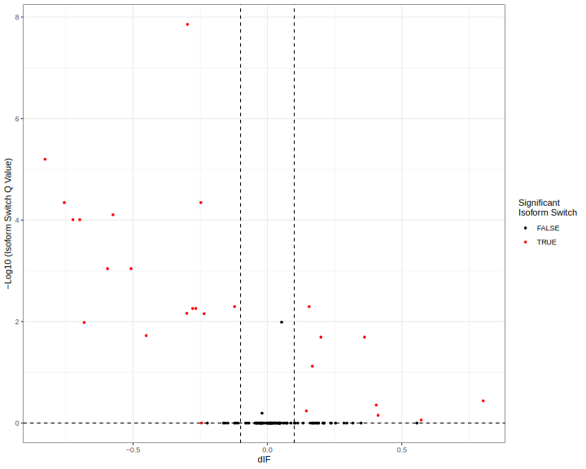

- **Axis Interpretation**: The x-axis represents the **dIF** (difference in Isoform Fraction), showing the magnitude of the switch. The y-axis shows the **-Log10 (Q-value)**, representing statistical significance.
- **Significant Switches**: Points colored in **red** represent significant isoform switches that pass both the Q-value and dIF thresholds. Points clustered at the bottom or in the center (black) indicate isoforms with negligible or non-significant changes between conditions.

#### 2. Alternative Splicing and Functional Consequences

Isoform switches often lead to physical changes in the protein or transcript, such as losing a domain or becoming sensitive to degradation.

### Splicing Event Summary

The bar and violin plots quantify the types of alternative splicing events (e.g., Exon Skipping, Intron Retention) contributing to these switches.

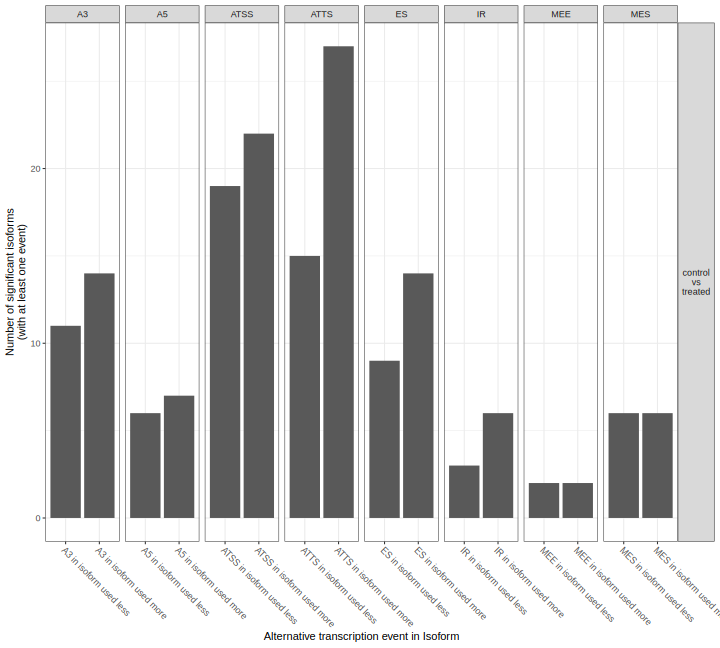
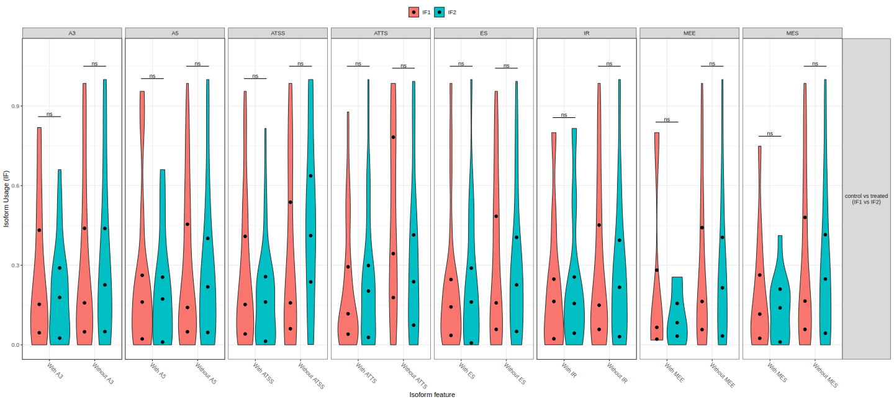

- **Dominant Events**: The **Splicing Summary Plot** shows the number of significant isoforms used more or less in each category. For instance, **ATTS** (Alternative Transcription Termination Site) and **ATSS** (Alternative Transcription Start Site) appear highly frequent in this dataset.
- **Isoform Usage (IF)**: The **Genomewide Plot** visualizes the distribution of isoform fractions. "ns" indicates that while many isoforms exist, the global shifts in certain categories like **ES** (Exon Skipping) or **IR** (Intron Retention) may not be statistically significant across all genes.

#### Functional Impact

The consequences of these switches are summarized by their effect on the Open Reading Frame (ORF).

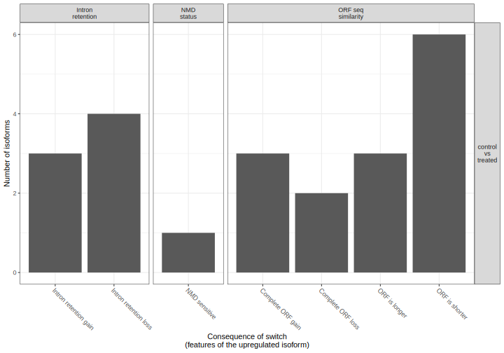

- **ORF Length**: A significant number of upregulated isoforms result in a **shorter ORF**, which can drastically alter protein function.
- **NMD Sensitivity**: Some switches result in transcripts that are **NMD sensitive**, meaning they are likely targeted for Nonsense-Mediated Decay rather than being translated into protein.

#### 3. Gene-Specific Example: _EIF4B_

The switch plot for _EIF4B_ provides a detailed look at how these global trends manifest in a single gene.

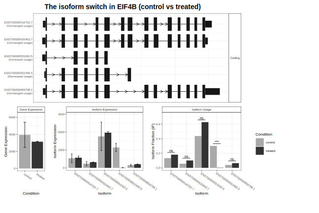

- **Isoform Structure**: The top panel compares multiple transcripts. Note **ENST00000552490.5**, which shows **decreased usage** in the treated condition (black bar in the "Isoform Usage" chart).
- **Switch Dynamics**: In the "Isoform Usage (IF)" graph, you can clearly see a significant increase (marked with `***`) for one isoform and a corresponding decrease in another, confirming a prioritized "switch" in transcript preference under treated conditions.

#### 4. Enrichment Analysis

The enrichment plot determines if the observed splicing switches are biased toward certain biological directions.

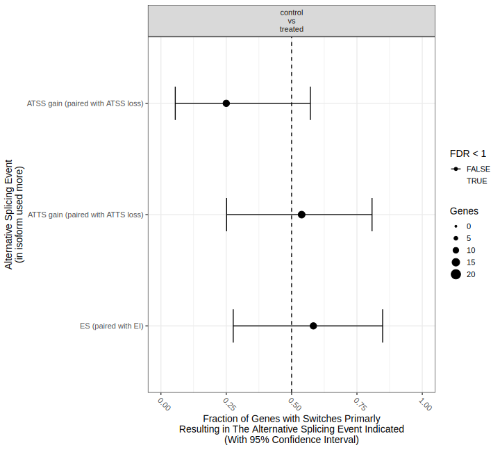

- **Directional Bias**: This plot shows the fraction of genes with switches resulting in specific events. For example, if the dot for **ES (paired with EI)** is to the right of the 0.50 line, it indicates a general trend toward exon skipping in the treated group across the entire transcriptome.

---

### Differential Gene Expression

Gene-level differential expression is performed using the method specified by `--diffexpr_method`. Visualizations and enrichment analyses are generated automatically for genes passing the specified significance thresholds.

#### DESeq2 (Steady-state)

<details markdown="1">
<summary>Output files</summary>

- `differential_analysis/gene_expression/stats/`
  - `unfiltered_deg_results.rds` – Full results object for all tested genes.
  - `de_genes_full_table.rds` – Results table for genes passing significance thresholds.
  - `top_<top_n>_genes.rds` / `.csv` – Summary of the top N genes ranked by absolute log-fold change.
  - `deseq2_de_genes.rds` – Matrix of **VST-transformed** expression values for significant DEGs.
  - `vst_transformed.rds` – Full variance-stabilizing transformation object.
  - `unfiltered_counts.rds`, `filtered_counts.rds`, `normalized_counts.rds` – Log2 count matrices at each pipeline stage.
- `differential_analysis/gene_expression/plots_and_enrichment/`
  - `qc_plots/` – PCA and violin plots based on **VST-transformed** data.
  - `de_visualization/` – Volcano plots and Z-score normalized heatmaps of DEGs.
  - `GO_results/` – Enriched **GO** terms (Biological Process, Molecular Function, Cellular Component) for up/down-regulated genes.
  - `KEGG_results/` – Significant **KEGG** pathways associated with up-regulated and down-regulated DEGs.
  - `GSEA_results/` – **MSigDB** results, including Normalized Enrichment Scores (NES) and running enrichment plots.

</details>

**DESeq2** identifies differentially expressed genes by applying a negative binomial generalized linear model to count data. It utilizes **size factor normalization** to account for sequencing depth and **apeglm shrinkage** to provide more accurate log-fold change estimates for lowly expressed genes. Subsequently, **Functional Enrichment** (GO/KEGG) is executed for up- and down-regulated gene sets. Additionally, a **GSEA** is performed using the **MSigDB** collections (if enabled via `--enrichment_method`), ranking all genes to identify significant pathway shifts regardless of arbitrary fold-change cutoffs.

##### 1. Data Quality and Normalization

Before identifying differential genes, we assess the distribution of sequencing reads across all samples to ensure the normalization process was successful.

###### Log-Count Distribution

The violin plots visualize the gene expression levels before and after processing.

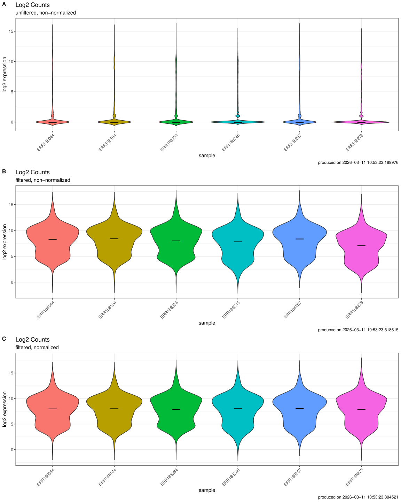

- **Panel A (Unfiltered):** Shows a high density near zero, representing the typical background noise of lowly expressed genes in RNA-seq.
- **Panel B & C (Filtered & Normalized):** The distributions are now more uniform across all samples. This confirms that **size factor normalization** has successfully accounted for differences in sequencing depth.

---

##### 2. Global Sample Relationships (PCA)

Principal Component Analysis (PCA) determines if the overall expression profiles allow us to distinguish between our experimental groups.

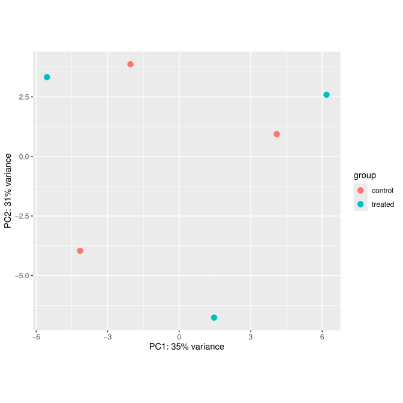

- **Clustering:** In this plot, the **Control** (coral) and **Treated** (teal) samples do not form tight, distinct clusters on the PC1 axis (35% variance).
- **Interpretation:** This suggests that the biological "signal" between conditions is relatively subtle compared to the "noise" or variance between individual replicates in this specific experiment.

---

##### 3. Differential Expression Results

This section quantifies which genes are significantly up- or down-regulated.

###### Volcano Plot of Statistical Significance

The volcano plot maps the magnitude of change against statistical significance.

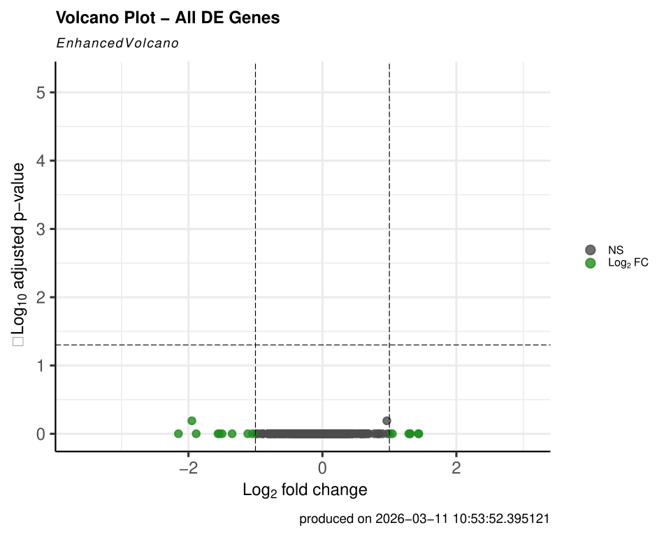

- **Thresholds:** The vertical dashed lines represent a **Log2 Fold Change** cut-off, and the horizontal line represents the **Adjusted P-value** (FDR) significance threshold.
- **Current Status:** Most genes (gray) are not significant. The green points indicate genes with a high fold change that have not yet reached statistical significance ($P_{adj} < 0.05$).

###### Statistical Summary Table

The raw metrics for individual genes from `unfiltered_deg_results.rds` provide the mathematical basis for the plots above.

```text
                baseMean    logFC       lfcSE       pvalue     adj.P.Val
ENSG00000003096  33.88     1.28        1.34        0.33       0.99
```

- **LogFC:** Gene `ENSG00000003096` shows a 1.28 log-fold increase in the treated group.
- **adj.P.Val:** However, with an adjusted p-value of **0.99**, this change is statistically indistinguishable from random variation.

---

##### 4. Differentially Expressed Genes (Heatmap)

For genes that do pass significance filters, a heatmap is used to visualize the consistency of expression across replicates.

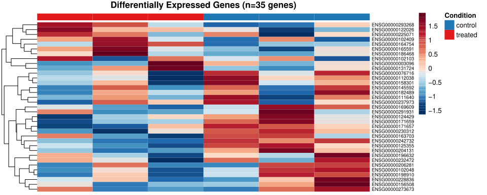

- **Color Scale:** Red indicates high expression (z-score > 0), and blue indicates low expression.
- **Consistency:** Look for rows where all three "Treated" columns are one color and all three "Control" columns are another. This indicates a robust biological response.

---

#### limma (Steady-state)

<details markdown="1">
<summary>Output files</summary>

- `differential_analysis/gene_expression/stats/`
  - `ebfit.rds` – The empirical Bayes moderated linear model fit.
  - `unfiltered_deg_results.rds` – Full results object for all tested genes.
  - `de_genes_full_table.rds` – Results table for genes passing significance thresholds.
  - `top_<top_n>_genes.rds` / `.csv` – Summary of the top N genes ranked by absolute log-fold change.
  - `de_expression_values.rds` – Matrix of **log2CPM** values for significant DEGs.
  - `voom_transformed.rds` – Full **EList** object from the voom transformation.
  - `unfiltered_counts.rds`, `filtered_counts.rds`, `normalized_counts.rds` – Log2 count matrices at each pipeline stage.
- `differential_analysis/gene_expression/plots_and_enrichment/`
  - `qc_plots/` – **Voom** mean-variance plots, MDS, and PCA plots.
  - `de_visualization/` – Volcano plots and Z-score normalized heatmaps of DEGs.
  - `GO_results/` – Enriched **GO** terms (Biological Process, Molecular Function, Cellular Component) for up/down-regulated genes.
  - `KEGG_results/` – Significant **KEGG** pathways associated with up-regulated and down-regulated DEGs.
  - `GSEA_results/` – **MSigDB** results, including Normalized Enrichment Scores (NES) and running enrichment plots.

</details>

**limma** performs differential expression analysis by applying moderated linear models to log-transformed counts. It incorporates the **voom transformation** to model the mean-variance relationship, allowing the pipeline to utilize powerful linear modeling techniques for complex experimental designs. Subsequently, **Functional Enrichment** (GO/KEGG) is executed for up- and down-regulated gene sets. Additionally, a **GSEA** is performed using the **MSigDB** collections (if enabled via `--enrichment_method`), ranking all genes to identify significant pathway shifts regardless of arbitrary fold-change cutoffs.

##### 1. The `limma-voom` Approach

While DESeq2 uses a negative binomial model, **limma** was originally designed for microarrays. To use it for RNA-seq, the **voom transformation** is applied.

- **Voom Transformation:** This converts raw counts into log-counts per million (log-cpm) and estimates a "precision weight" for each observation.
- **Moderated t-statistics:** Limma "borrows" information across all genes to make the analysis robust, even with small sample sizes.

##### 2. Dimensionality Reduction: PCA vs. MDS

The primary difference you see in these plots compared to DESeq2 comes from how the data is transformed and which dimensions are prioritized.

###### PCA Plot (Principal Component Analysis)

The PCA plot in limma visualizes the directions (Principal Components) along which the variation in the data is maximal.

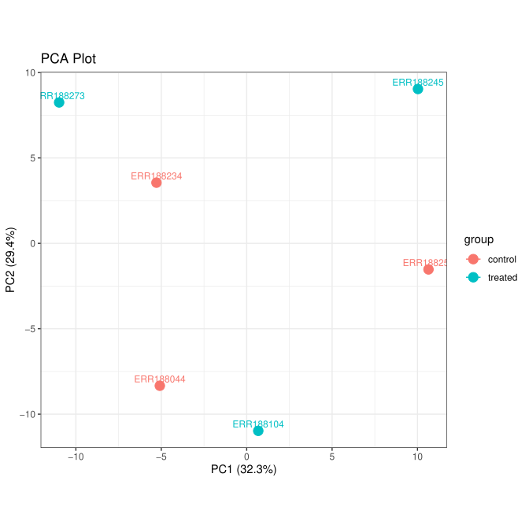

- **PC1 (32.3%) & PC2 (29.4%):** These axes represent the two largest sources of variation in your experiment.
- **Sample Distribution:** Similar to your DESeq2 PCA, the samples (e.g., `ERR188273`, `ERR188044`) are spread across the plot rather than forming tight control vs. treated clusters. This suggests that the individual variability between biological replicates is almost as large as the effect of the treatment itself.

###### MDS Plot (Multi-Dimensional Scaling)

The MDS plot is similar to PCA but focuses specifically on the **log-fold changes** between samples.


- **Leading logFC:** The distances on an MDS plot correspond to the root-mean-square of the largest log-fold changes between each pair of samples.
- **Interpretation:** This plot is often "cleaner" for identifying outliers. If a sample is a technical failure, it will appear far away from all other points. Here, the "treated" and "control" labels are interspersed, reinforcing the finding that there is no massive, transcriptome-wide shift between your groups.

##### 3. Comparison with DESeq2

You noticed the PCA/MDS look different than the DESeq2 plots. This is expected because:

1.  **Normalization:** DESeq2 uses `vst` transformations; limma uses `voom` (log-cpm with weights).
2.  **Distance Metrics:** MDS (in limma) specifically calculates distance based on the top 500 genes with the largest log-fold changes, whereas standard PCA looks at the variance of the entire filtered dataset.

---

#### maSigPro (Time-course)

<details markdown="1">
<summary>Output files</summary>

- `differential_analysis/gene_expression/stats/masigpro_results/`
  - `masigpro_clusterplots.pdf` – Combined visualization of median gene expression kinetics across clusters.
  - `cluster_assignments.csv` – Mapping of significant genes to their respective clusters.
  - `summary_statistics.csv` – Overview of parameters including **R-squared**, **Q-value**, and **polynomial degree**.
  - `clusters_list.rds` – Full R object containing clustering results.
  - `unfiltered_counts.rds`, `filtered_counts.rds`, `normalized_counts.rds` – Log2 count matrices at each pipeline stage.
- `differential_analysis/gene_expression/plots_and_enrichment/`
  - `qc_plots/` – PCA and violin plots based on **VST-transformed** data.
  - `de_visualization/heatmap/masigpro/`
    - `cluster_<ID>_heatmap.pdf` – Detailed Z-score normalized heatmaps for each temporal cluster.
  - `GO_results/` – **GO** term enrichment results (dotplots, barplots, and tables) performed specifically on genes within each significant temporal cluster.
  - `KEGG_results/` – **KEGG** pathway enrichment results performed specifically on genes within each significant temporal cluster.

</details>

maSigPro utilizes polynomial regression to identify genes with significant temporal patterns across conditions. Genes passing the **R-squared** and **Q-value** thresholds are grouped into clusters using the method defined by `--cluster_method`. Subsequently, **Functional Enrichment** (GO/KEGG) is executed for each individual cluster to identify the specific biological processes and pathways associated with each distinct temporal expression profile.

##### 1. Temporal Profile Analysis

Unlike standard differential expression that compares two static points, **maSigPro** uses a two-stage regression approach to identify genes whose expression profiles over time differ between conditions (e.g., Control vs. Mutant).

###### Cluster Plot Interpretation

The cluster plots visualize the median expression levels of genes that share similar temporal behaviors across the 6, 12, 18, and 24-hour timepoints.

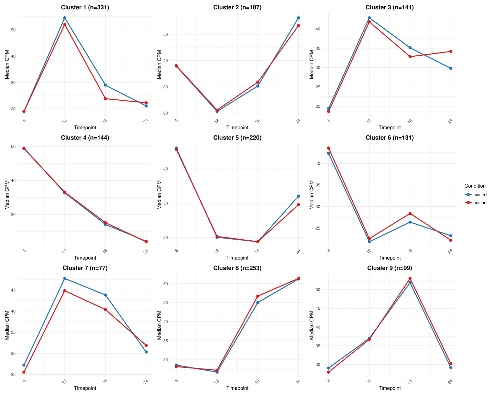

- **Axis Interpretation**: The x-axis represents the **Timepoints**, and the y-axis shows the **Median CPM** (Counts Per Million), indicating the normalized expression level for that cluster.
- **Condition Comparison**: The **blue line** represents the Control group, while the **red line** represents the Mutant group.
- **Diverse Trajectories**:
  - **Cluster 1 (n=331)**: Shows a sharp peak at 12 hours for both groups, with the Control group exhibiting slightly higher expression.
  - **Cluster 2 (n=187)**: Represents genes that are upregulated later in the time course (after 12 hours).
  - **Cluster 4 (n=144)**: Shows a steady downward trend in expression from 6 to 24 hours in both conditions.

##### 2. Statistical Thresholding

Genes are only included in these clusters if they meet specific statistical criteria defined in the analysis:

- **R-squared ($R^2$):** Measures how well the polynomial regression model fits the data. A higher value indicates a more reliable temporal trend.
- **Q-value:** The adjusted p-value ensuring the observed temporal change is statistically significant after correcting for multiple testing.

##### 3. Functional Meaning of Clusters

By grouping genes with similar "rhythms," we can infer the biological timing of different processes.

- **Early Response (e.g., Cluster 6)**: Genes that peak early (6 hours) and then drop likely represent the initial cellular response to the treatment or mutation.
- **Late Response (e.g., Cluster 8)**: Genes that only begin to rise after 12 hours are likely involved in secondary effects or long-term adaptation.

---

### WGCNA (Co‑expression Network Analysis)

<details markdown="1">
<summary>Output files</summary>

- `differential_analysis/coexpression/WGCNA/` - `unfiltered_counts.rds`, `filtered_counts.rds`, `normalized_counts.rds` – Log2 count matrices at each pipeline stage. - `soft_threshold_selection.pdf` – Scale independence and mean connectivity plots for power selection. - `module_dendrogram.pdf` – Hierarchical clustering of genes with unmerged and merged module colors. - `module_trait_correlation_heatmap.pdf` – Matrix correlating module eigengenes with clinical traits. - `all_traits_modules_hubgenes.rds` – Comprehensive R object containing all traits, significant modules, and their respective hub gene expression matrices. - `module_analysis/<TRAIT>/` - `csv/` – Tables for `<COLOR>_genes.csv` (all) and `<COLOR>_hub_genes.csv` (prioritized). - `plots/` – `MM_vs_GS_<COLOR>.pdf` scatterplots validating module-trait relevance.
- `differential_analysis/coexpression/STRING_PPI/`
  - `analysis_summary.csv` – Global metrics for traits and modules processed through the STRING database.
  - `<TRAIT>/`
    - `STRING_cytoscape_edges/` – Edge lists (`_ppi_edges.csv`) formatted for Cytoscape import.
    - `network_summaries/` – Mapping rates and interaction statistics for each module network.
- `differential_analysis/coexpression/plots/`
  - `qc_plots/` – PCA and violin plots of the VST-normalized data used for WGCNA.
  - `de_visualization/heatmap/WGCNA/<TRAIT>/` – Z-score normalized heatmaps of top hub genes per module.
- `differential_analysis/coexpression/enrichment/`
  - `GO_results/` – GO enrichment on hub genes per significant module.
  - `KEGG_results/` – KEGG enrichment on hub genes per significant module.

</details>

[WGCNA](https://horvath.genetics.ucla.edu/html/CoexpressionNetwork/Rpackages/WGCNA/) identifies clusters of co-expressed genes (modules) and correlates them with clinical or experimental traits. Within significant modules, **hub genes** are prioritized based on high Module Membership (MM) and Gene Significance (GS). To provide a systems-level view, STRINGdb is used to map these hub genes to protein-protein interaction (PPI) networks, filtering for high-confidence associations based on a user-defined score threshold. The analysis concludes with cluster-specific **Functional Enrichment** to determine the biological pathways driving each trait-associated module.

#### 1. WGCNA: No Timepoint Analysis

This analysis treats all treated samples as one group and all control samples as another, regardless of when they were collected. It is ideal for finding core gene modules driven purely by the experimental condition.

##### Network Topology & Modules

- **Soft Thresholding:** A power $\beta$ of **14** was selected to achieve scale-free topology, balancing network connectivity with biological realism.
  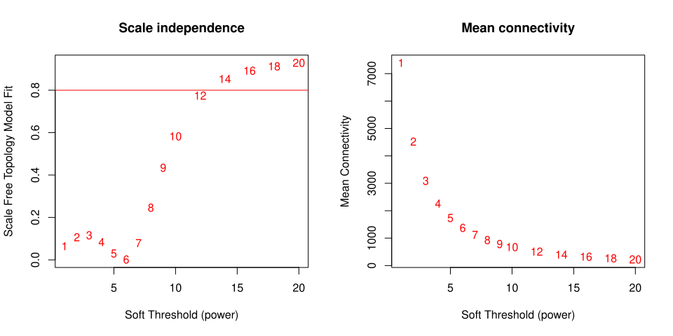
- **Module Identification:** Hierarchical clustering identified several distinct modules, including **turquoise**, **blue**, and **brown**.
  

##### Trait Correlation (No Timepoint)

- **Treatment Response:** The **Module-Trait Correlation Heatmap** shows how strongly each color-coded module relates to the "disease" vs. "control" status.
  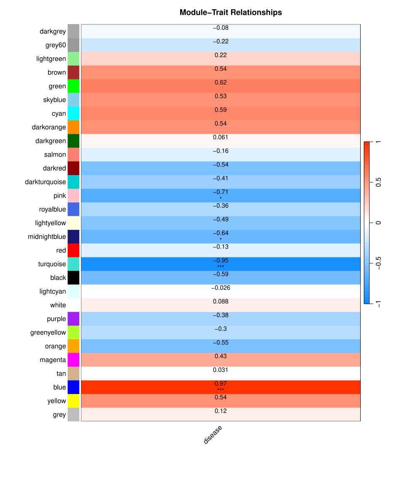
- **Key Findings:** High correlation values ($r$) in specific modules (like **blue**) indicate that these genes are the primary drivers of the difference between your conditions.

#### 2. WGCNA: Timepoint Analysis

This analysis correlates gene modules with specific intervals (6h, 12h, 18h, 24h) to identify "waves" of gene expression.

##### Module Trajectories

- **Temporal Clustering:** The modules here are defined by how genes rise or fall together over the 24-hour period.
  

##### Trait Correlation (With Timepoint)

- **Stage-Specific Modules:** The heatmap for this analysis shows correlations with individual timepoints.
  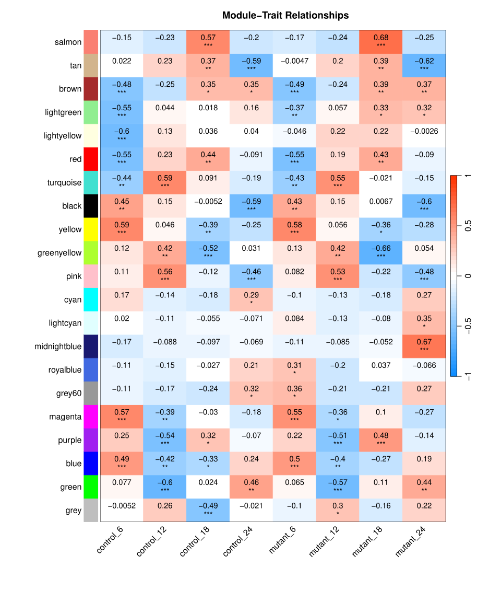
- **Interpretation:** For example, the **green module** shows a strong **negative** correlation with the **control_12h** time point, while the **midnightblue module** exhibits a strong positive correlation with the **mutant_24h** time point. This opposing pattern identifies gene modules involved in distinct biological transitions—those repressed at the mid-experiment point (12h) versus those activated later (24h) under mutant conditions.

#### 3. Comparison of Eigengene Expressions

The **Module Eigengene (ME)** heatmaps visualize the "fingerprint" of each module across every individual sample in your study.

| Analysis Type    | Visual Evidence                                              | Observations                                                                                                                  |
| :--------------- | :----------------------------------------------------------- | :---------------------------------------------------------------------------------------------------------------------------- |
| **No Timepoint** | 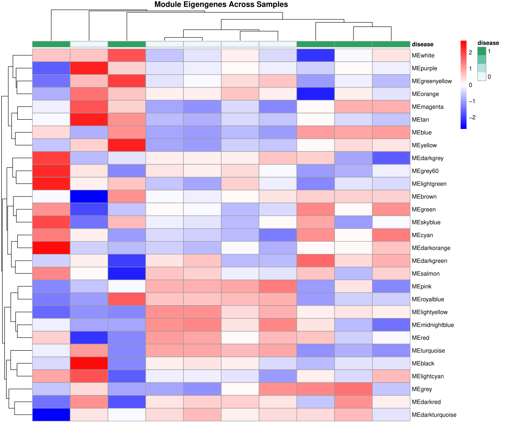 | Shows consistent blocks of expression that separate treated samples from controls across the entire study.                    |
| **Timepoint**    | 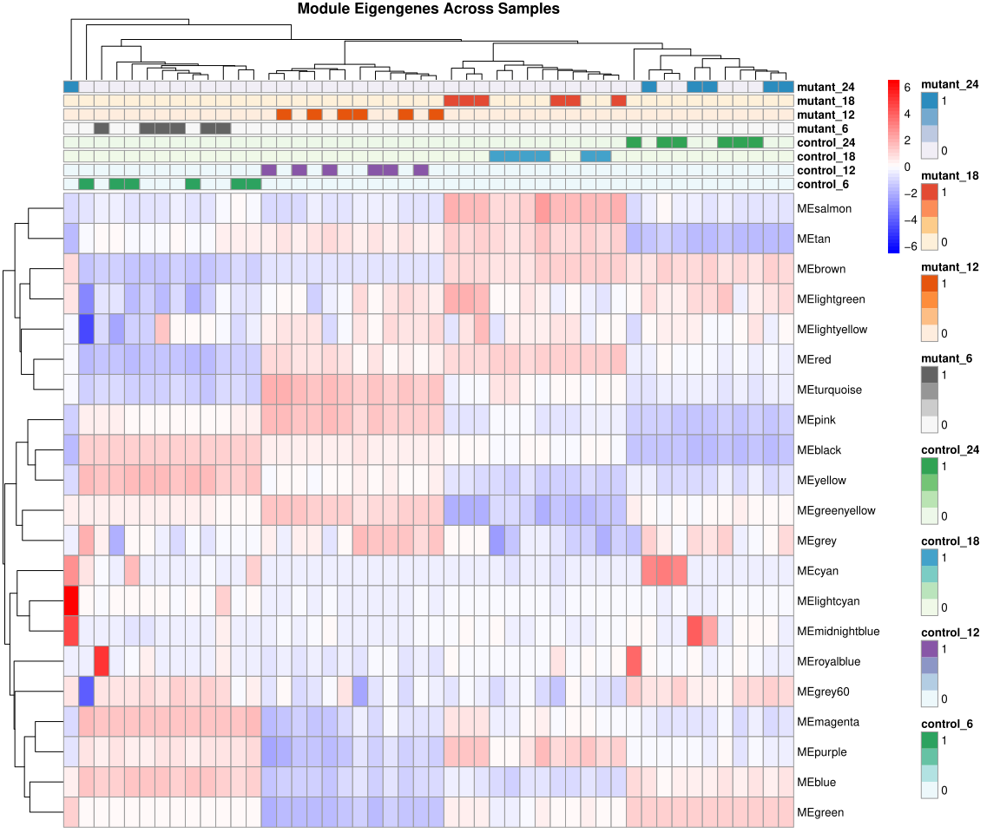   | Shows shifting patterns where expression levels move in "waves" corresponding to the 6, 12, 18, and 24-hour collection marks. |

---

## Quality Control

### RSeQC

<details markdown="1">
<summary>Output files</summary>

- `quality_control/rseqc/`
  - `bam_stat/<SAMPLE>/`
    - `<SAMPLE>.bam_stat.txt`: Detailed mapping statistics and read counts.
  - `genebody_coverage/<SAMPLE>/`
    - `<SAMPLE>.geneBodyCoverage.curves.pdf`, `<SAMPLE>.geneBodyCoverage.heatMap.pdf` – Visualizations of read coverage uniformity over gene bodies.
    - `<SAMPLE>.geneBodyCoverage.r` – R script used to generate the coverage plots.
    - `<SAMPLE>.geneBodyCoverage.txt` – Normalized coverage data values.
    - `log.txt` – Module execution log.
  - `infer_experiment/<SAMPLE>/`
    - `<SAMPLE>.infer_experiment.txt` - Statistics for determining RNA‑seq library strandedness.
  - `inner_distance/<SAMPLE>/`
    - `<SAMPLE>.inner_distance_plot.pdf` – Frequency plot of the inner distance between pairs.
    - `<SAMPLE>.inner_distance_plot.r` – R script for the inner distance plot.
    - `<SAMPLE>.inner_distance.txt`, `<SAMPLE>.inner_distance_freq.txt` – Tabular inner distance and frequency data.
  - `junction_annotation/<SAMPLE>/`
    - `<SAMPLE>.junction.pdf`, `<SAMPLE>.events.pdf` – Visualizations of known vs. novel splice junctions.
    - `<SAMPLE>.junction_plot.r` – R script for junction visualization.
    - `<SAMPLE>.junction.xls`, `<SAMPLE>.junction_annotation.log` – Detailed junction statistics and discovery logs.
    - `<SAMPLE>.junction.bed`, `<SAMPLE>.Interact.bed` – BED files containing junction coordinates.

  - `read_distribution/<SAMPLE>/`
    - `<SAMPLE>.read_distribution.txt` – Quantification of reads mapping to CDS, UTRs, and introns.

  - `read_duplication/<SAMPLE>/`
    - `<SAMPLE>.DupRate_plot.pdf` – Plots showing sequence-level and position-level duplication rates.
    - `<SAMPLE>.DupRate_plot.r` – R script for duplication plots.
    - `<SAMPLE>.seq.DupRate.xls`, `<SAMPLE>.pos.DupRate.xls` – Tabular data for duplication metrics.
  - `tin/<SAMPLE>/`
    - `<SAMPLE>.tin.xls` – **Transcript Integrity Number** values for each transcript.
    - `<SAMPLE>.summary.txt` – Median TIN score summary for the sample.

</details>

[RSeQC](http://rseqc.sourceforge.net/) provides a comprehensive set of RNA‑seq specific QC metrics to evaluate the quality of the final alignments. Specific modules are controlled via the `--rseqc_modules` parameter, allowing for targeted assessment of library strandedness, transcript coverage bias, and splicing accuracy.

#### Mapping Efficiency and Strandedness

The `bam_stat` and `infer_experiment` modules confirm the technical success of the sequencing run and the library preparation protocol.

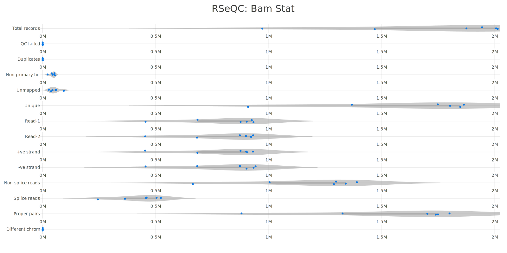
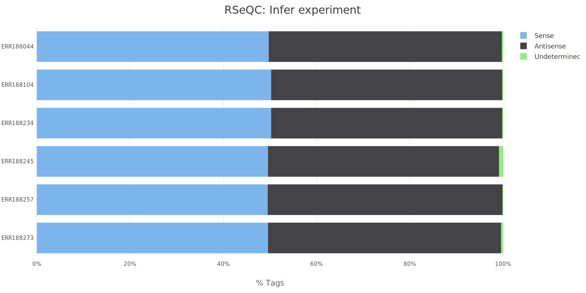

---

#### Transcript Coverage and Gene Body Bias

For Poly(A) enriched samples, the `genebody_coverage` plot is essential to check for RNA degradation. A flat curve indicates high-quality, full-length transcript capture, whereas a 3' peak would suggest degraded input material.

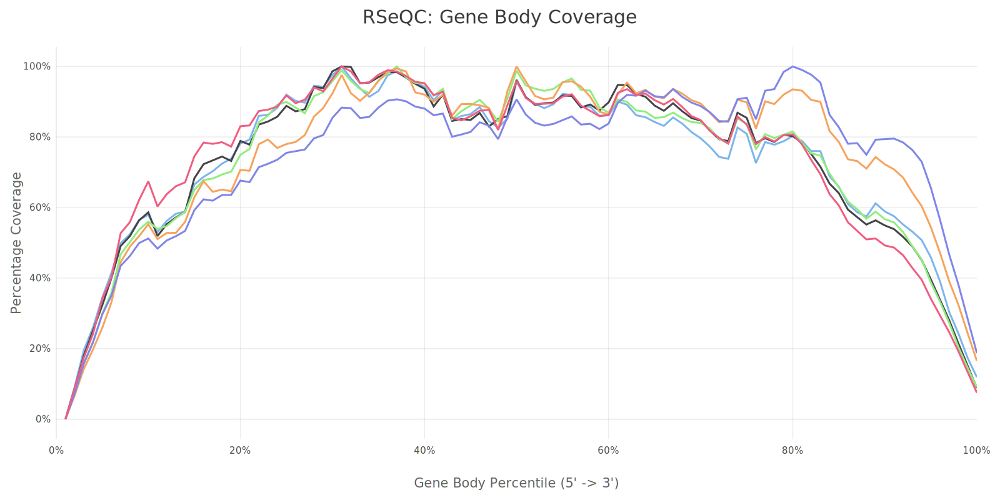

---

#### Genomic Feature Distribution

The `read_distribution` module ensures that the library is truly enriched for mRNA. In a successful run, the majority of reads should map to CDS and UTR regions rather than introns or intergenic space.

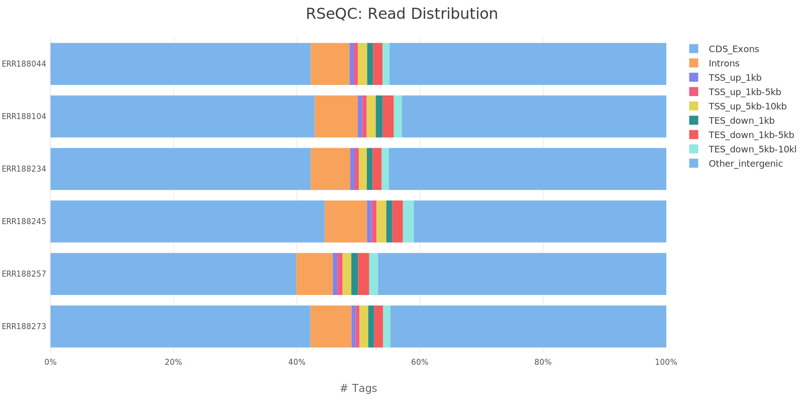

---

#### Splicing and Fragment Architecture

`junction_annotation` and `inner_distance` validate the biological complexity of the library and the physical fragment size distribution, which are critical for accurate isoform quantification in tools like **Salmon** or **Kallisto**.

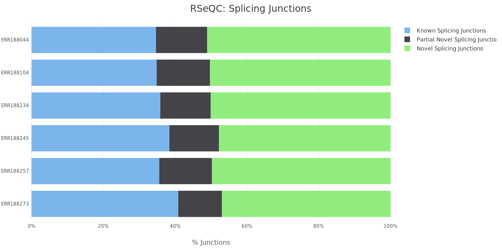
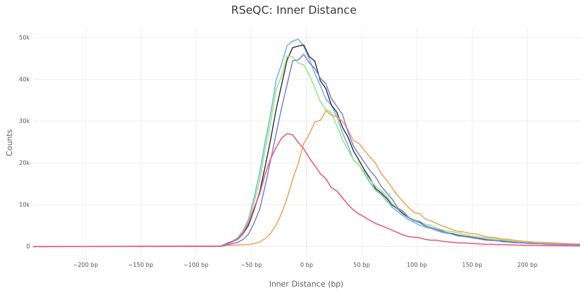

---

#### Sequence Redundancy

Finally, the `read_duplication` module assesses library complexity. While high duplication is common for abundant transcripts in Poly(A) data, these plots help identify technical PCR over-amplification.

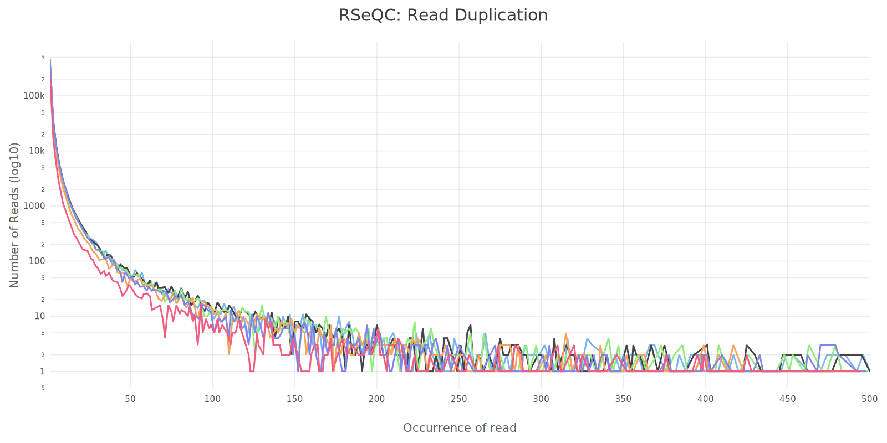

### MultiQC

<details markdown="1">
<summary>Output files</summary>

- `quality_control/multiqc/`
  - `multiqc_report.html` – Standalone HTML report.
  - `multiqc_data/` – Directory containing parsed statistics from all tools.
  - `multiqc_plots/` – Directory containing static images from the report.

</details>

[MultiQC](http://multiqc.info) consolidates logs and results from across the entire pipeline into a single visual summary. Based on the workflow execution, it integrates:

- **Pre-processing**: Raw and trimmed **FastQC** reports, **Cutadapt** trimming stats, **BBSplit** contamination checks, and **SortMeRNA** ribosomal RNA depletion logs.

- **Alignment & Quantification**: **HISAT2** mapping summaries, **Salmon/Kallisto** pseudo-alignment counts, and **featureCounts** gene-level quantification summaries.

- **Transcript Quality (RSeQC)**: Comprehensive metrics including **Gene Body Coverage**, **BAM Stat**, **Inner Distance**, **Junction Annotation**, **Read Duplication**, and **TIN scores**.

- **Variant Calling**: Post-processing metrics from **Picard**, **GATK** Base Recalibration (BQSR) tables, and **SnpEff** functional annotation summaries.

- **Custom Stats**: Unique pipeline metrics such as **UMI** deduplication logs and custom script outputs are parsed to provide a holistic view of data quality.

---

### Workflow reporting and genomes

#### Reference files

If `--save_reference` is specified, reference indices and auxiliary files are saved for reuse.

<details markdown="1">
<summary>Output files</summary>

- `reference/`
  - `hisat2/` – HISAT2 index files (`.ht2`).
  - `sortmerna/` – SortMeRNA index.
  - `bbsplit/` – BBSplit index (multiple references).
  - `salmon/` – Salmon index (directory or `.tar.gz`).
  - `kallisto/` – Kallisto index (`.idx`).
  - `genome/` – Primary annotation and sequence files:
    - FASTA (`.fasta`/`.fa`), GTF, GFF, and BED files.
    - Fasta index (`.fai`), Sequence dictionary (`.dict`), and unzipped interval lists.
    - Derived splice sites and exons for HISAT2.
    - Scattered interval lists
  - `variation/` – – Files specifically required for Variant Calling (GVC):
    - Tabix-indexed dbSNP and Known Sites VCFs (`.vcf.gz`, `.tbi`).
    - GATK-formatted interval lists converted from BED (`.interval_list`).
  - `snpeff/` – SnpEff database.

</details>Saving the reference allows subsequent pipeline runs to skip index building, saving time and compute resources.

#### Pipeline information

<details markdown="1">
<summary>Output files</summary>

- `pipeline_info/`
  - `execution_report_<timestamp>.html` – Nextflow execution report.
  - `execution_timeline_<timestamp>.html` – Nextflow timeline.
  - `execution_trace_<timestamp>.txt` – Nextflow trace.
  - `pipeline_dag_<timestamp>.dot`/`.svg` – Pipeline DAG.
  - `pipeline_report.html`/`.txt` – Summary of pipeline run (if email enabled).
  - `software_versions.yml` – Versions of all software tools.
  - `params_<timestamp>.json` – Parameters used for the run.

</details>

[Nextflow](https://www.nextflow.io/docs/latest/tracing.html) provides detailed reports on resource usage, execution times, and workflow structure. The pipeline also outputs a validated samplesheet and software version information.

For a detailed description of all available parameters and how to run the pipeline, please refer to the [usage documentation](https://nf-co.re/rnaseq/usage).
